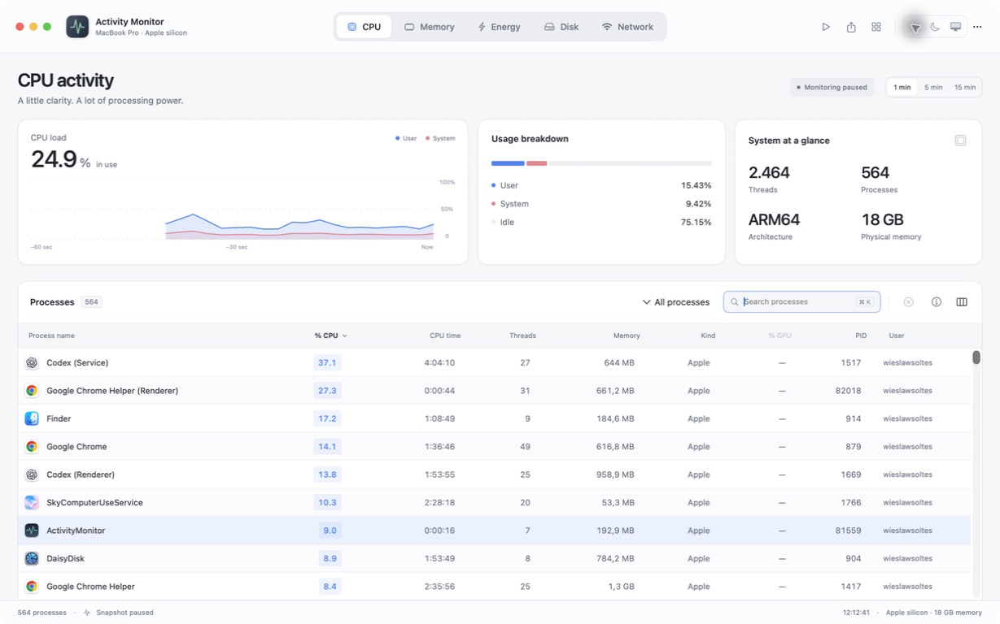
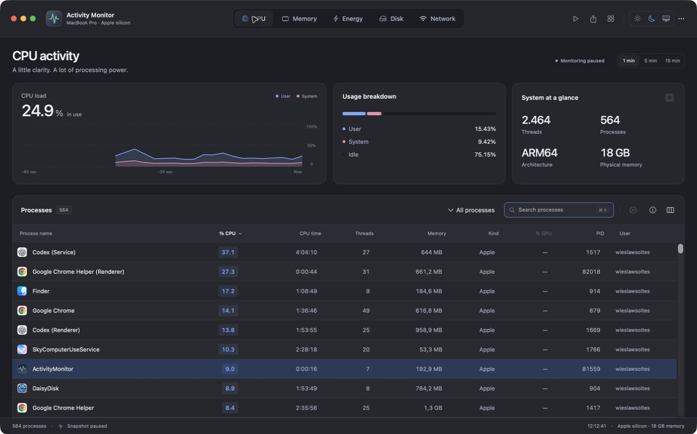

# Activity Monitor

### A clearer view of your Mac.

Keep an eye on performance, understand resource usage, and find the processes that need your attention.

**[Download for macOS](https://github.com/wieslawsoltes/ActivityMonitor/releases/latest)** · [Installation](#installation) · [Features](#five-views-one-clear-picture)

## Five views. One clear picture.

| View | What you can see |
| :--- | :--- |
| **CPU** | Live processor usage, the busiest processes, CPU time and thread counts. |
| **Memory** | Memory pressure, active and compressed memory, swap, and each process’s footprint. |
| **Energy** | Battery charge, charging status, Low Power Mode, thermal state and application CPU workload. |
| **Disk** | Process reads and writes, transfer totals and current throughput. |
| **Network** | Incoming and outgoing traffic, packet activity and per-process byte counts. |

## Find the detail that matters

- **Find a process quickly.** Search by name, PID or user; filter and sort the list; choose the columns you need.
- **Look closer.** Inspect a process, copy its PID, reveal its executable, view open files or capture a stack sample.
- **Take action.** Quit or force quit your processes, with confirmation before termination.
- **Follow changes.** Switch between one-, five- and fifteen-minute histories, adjust the refresh interval or pause the view.
- **Keep a record.** Export process data as CSV or JSON and save diagnostic reports.
- **Stay informed.** Add the optional CPU monitor to your menu bar.

## Comfortable in any light

Choose light, dark or system appearance. A compact inspector keeps process details alongside the table, while the overview remains visible as you scroll.

*Screenshots show the running app with real system data.*

[Explore all five views in both themes](docs/screenshots/README.md).

## Smoother everyday monitoring

Tabs respond across their full bounds. Clear hover, press and search-focus feedback makes controls easier to use, while a lighter process table reduces the work needed to switch views. Sampling stays at the same frequency. See the [profiling results](docs/performance/README.md).

## Installation

1. Download the **universal DMG** from the [latest release](https://github.com/wieslawsoltes/ActivityMonitor/releases/latest).
2. Open the disk image and drag **Activity Monitor** into **Applications**.
3. Open Activity Monitor from Applications.

Requires **macOS 14 or later**. The same download supports **Apple silicon and Intel**. A ZIP containing the complete app is also available. This app is separate from Apple’s built-in Activity Monitor.

**First launch:** Current releases are ad-hoc signed and not Apple notarized. If macOS blocks a downloaded copy, attempt to open it, then use **System Settings → Privacy & Security → Open Anyway** if you trust the source. No security setting needs to be disabled.

To uninstall, quit the app and move it from Applications to the Trash. See [installation notes](INSTALL.md) for details.

## Keyboard controls

| Shortcut | Action |
| :--- | :--- |
| **⌘1–⌘5** | Switch views |
| **⌘K** | Search processes |
| **Space** | Pause or resume |
| **↑ / ↓** | Select a process when the list is focused |
| **Return / Escape** | Open or close the inspector when the list is focused |
| **⌘⇧E** | Export all processes as CSV |

The toolbar export button saves the current filtered and sorted list.

## Your data stays on your Mac

No accounts, telemetry or uploads. Reports and exports are saved to a location you choose. No administrator helper is installed.

macOS restricts some process information; unavailable values appear as **—**. The Energy view shows **CPU workload**, not Apple’s proprietary Energy Impact score. GPU usage and per-process packet counts are unavailable. Disk totals cover readable processes; network totals can differ from individual process counters. Histories begin at launch and stay in memory for up to fifteen minutes.

[Measurement details](docs/METRICS.md) · [Report an issue](https://github.com/wieslawsoltes/ActivityMonitor/issues) · [Development guide](DEVELOPMENT.md)

## Design

The interface is based on this [original design](https://chatgpt.com/share/6a9c6a89-70e0-83eb-a977-4ca6e6f34766).
