

# Activity Monitor

### A clearer view of your Mac.

Keep an eye on performance, understand resource usage, and find the processes that need your attention.

**[Download for macOS](https://github.com/wieslawsoltes/ActivityMonitor/releases/latest)** · [Installation](#installation) · [Features](#six-views-one-clear-picture)

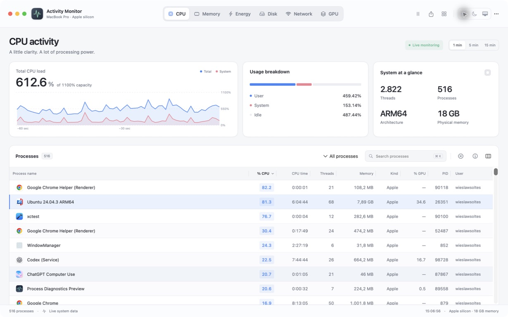

## Six views. One clear picture.

| View | What you can see |
| :--- | :--- |
| **CPU** | Live processor usage, the busiest processes, CPU time and thread counts. |
| **Memory** | Memory pressure, active and compressed memory, swap, and each process’s footprint. |
| **Energy** | Battery charge, charging status, Low Power Mode, thermal state and application CPU workload. |
| **Disk** | Process reads and writes, transfer totals and current throughput. |
| **Network** | Incoming and outgoing traffic, packet activity and per-process byte counts. |
| **GPU** | Device utilization, renderer and tiler activity, GPU memory, and per-process GPU usage and observed time where the driver exposes counters. |

## Find the detail that matters

- **Find a process quickly.** Find apps by their macOS display names—including virtual machine names—or search by executable, PID or user. Choose from 28 column types in every view, with choices saved per view. Additional columns stay hidden until you enable them.
- **Personal layouts.** Default columns fit the available width without unnecessary horizontal scrolling. Resize header dividers, double-click to fit contents, and drag columns into your preferred order. Each view remembers its widths, order and visible columns. Select ranges or multiple processes, copy rows, and explore parent/child process trees.
- **Look closer.** Open a process workspace with activity histories, threads, files, connections, ports, memory maps and diagnostic reports. Detach it into a floating tool window or pin the process to the menu bar.
- **Take action.** Quit or force quit your processes, with confirmation before termination.
- **Follow changes.** Switch between one-, five- and fifteen-minute histories, adjust the refresh interval or pause the view.
- **Keep a record.** Export process data as CSV or JSON and save diagnostic reports.
- **Stay informed.** Open all six views from your menu bar, with live charts, device details and the busiest processes.

## A workspace for each process

Right-click a process and choose **Process diagnostics…**. Follow its CPU, memory, energy, disk, network and GPU activity, then inspect individual threads, open files, listening ports and memory mappings. Resize and reorder columns, filter entries, copy rows, and export the details you need.

Keep several process monitors open as independent tool windows, float one above your workspace, or pin a process to the menu bar with your preferred live metric. Collect stack samples, virtual-memory reports, launch arguments and code-signing details without leaving the process workspace.

| Process workspace · Light | Process workspace · Dark |
| :---: | :---: |
| 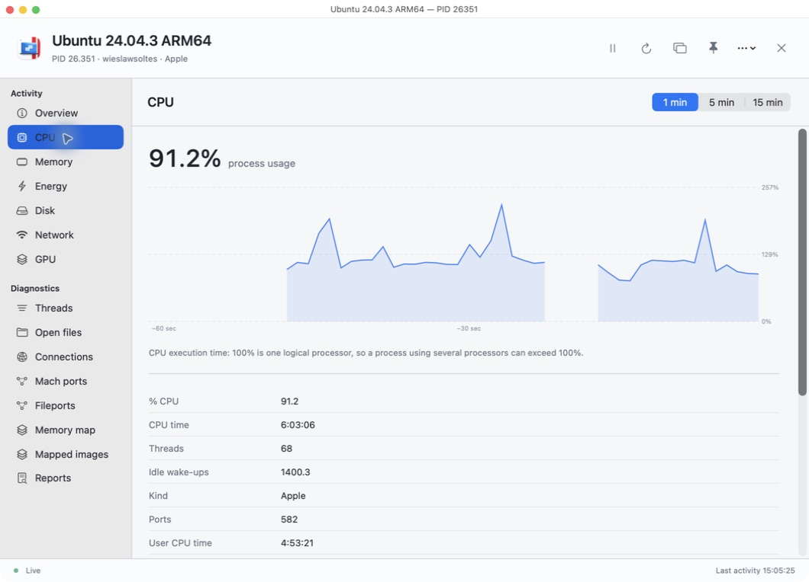 | 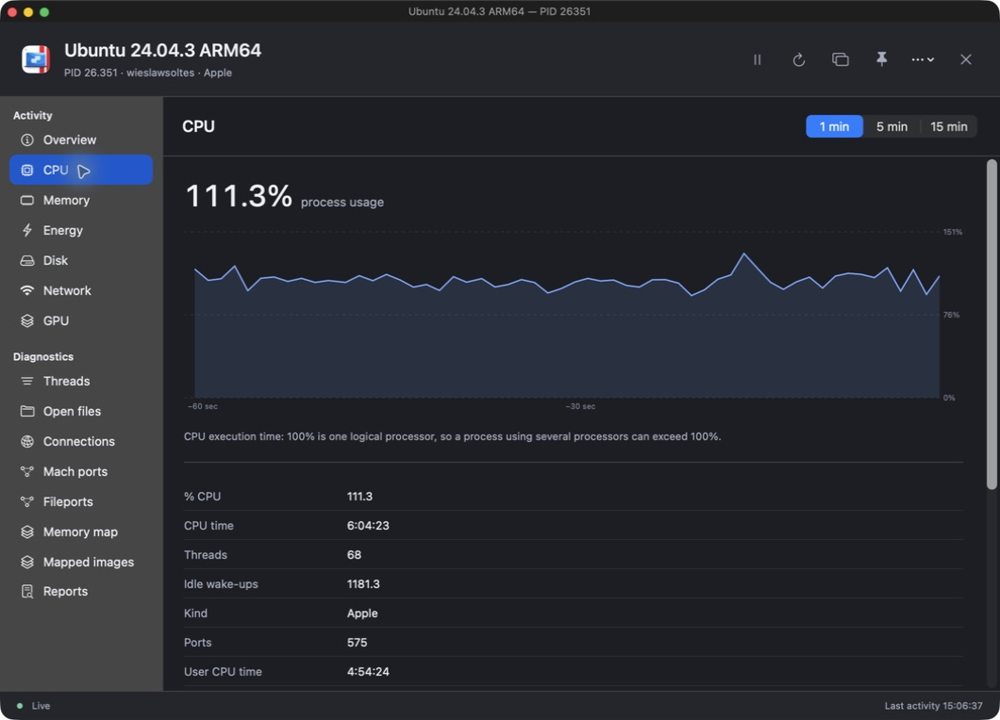 |

[Explore process diagnostics](docs/diagnostics/README.md).

## Comfortable in any light

Choose light, dark or system appearance. The process inspector sits beside wide workspaces and opens over compact windows.

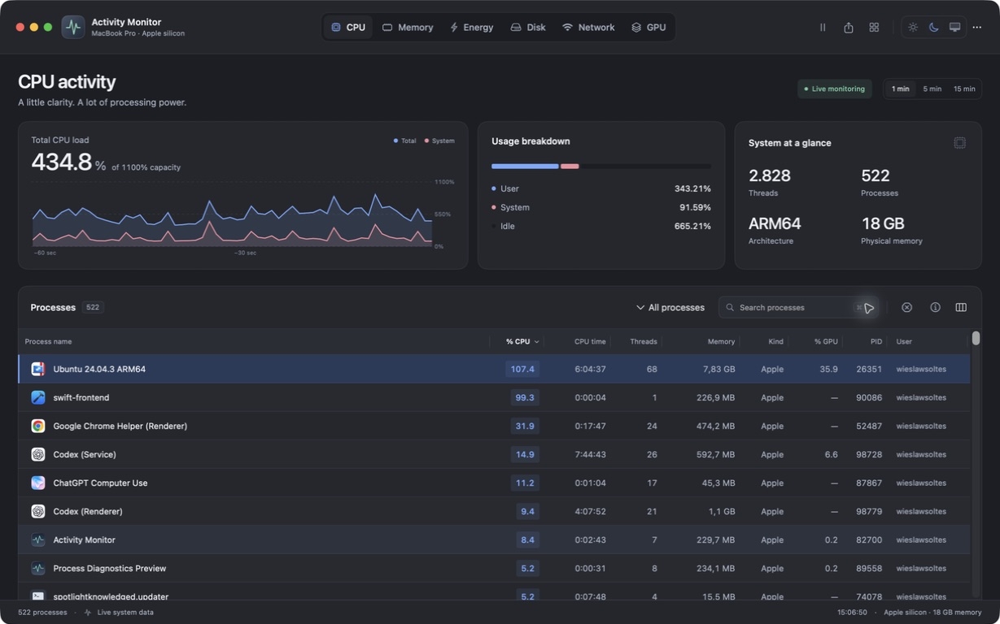

*Screenshots show the running app with real system data.*

[Explore all six views in both themes](docs/screenshots/README.md).

## Fits your workspace

Keep the familiar three-panel overview at the default size, use a compact window alongside other apps, or expand for larger histories and more process detail. Smaller and shorter windows use compact charts, tighter summary panels and streamlined controls to leave more room for processes. Narrow windows offer expandable breakdowns and access to the full column set. Hover over a chart to inspect a sample. With macOS **Keyboard navigation** enabled, use Tab to reach a chart and the arrow keys to inspect its history.

| Automatically fitted columns · Light | Automatically fitted columns · Dark |
| :---: | :---: |
| 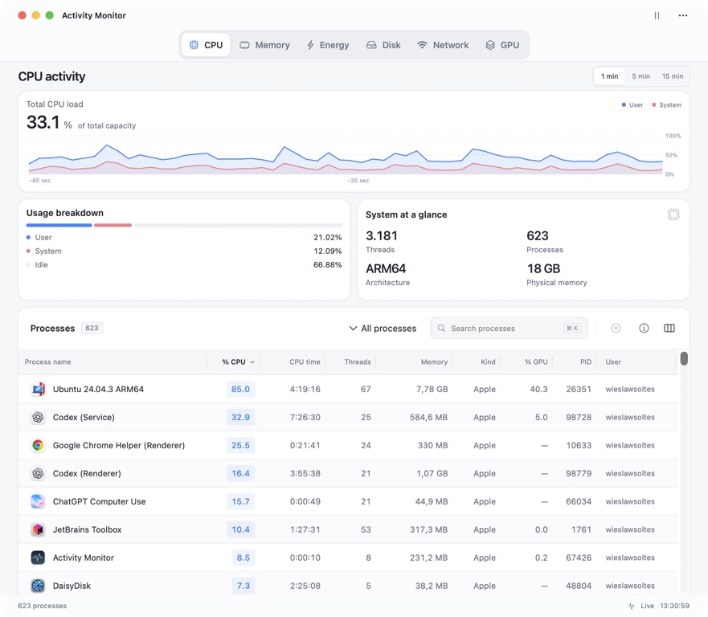 | 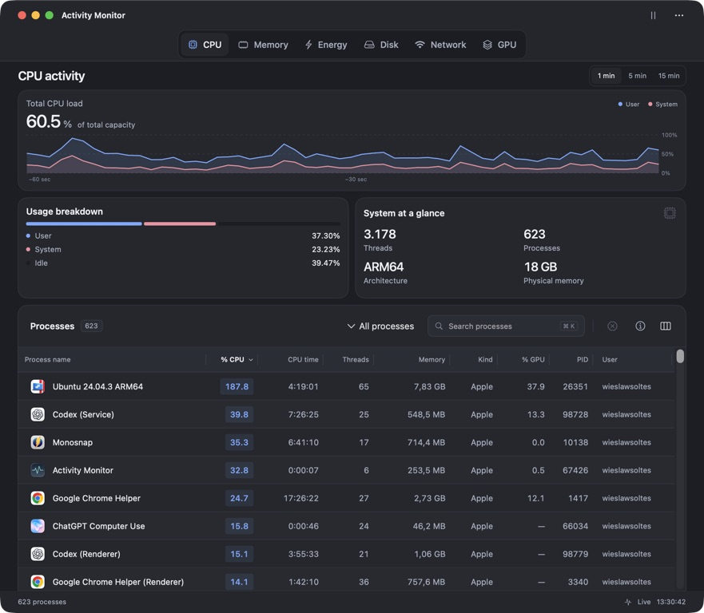 |

The menu-bar monitor brings all six views into a compact popover. Change the history range, select a GPU, pause monitoring, or open a process in the main window. Both surfaces share the same live session.

| Compact overview · Light | Compact overview · Dark |
| :---: | :---: |
| 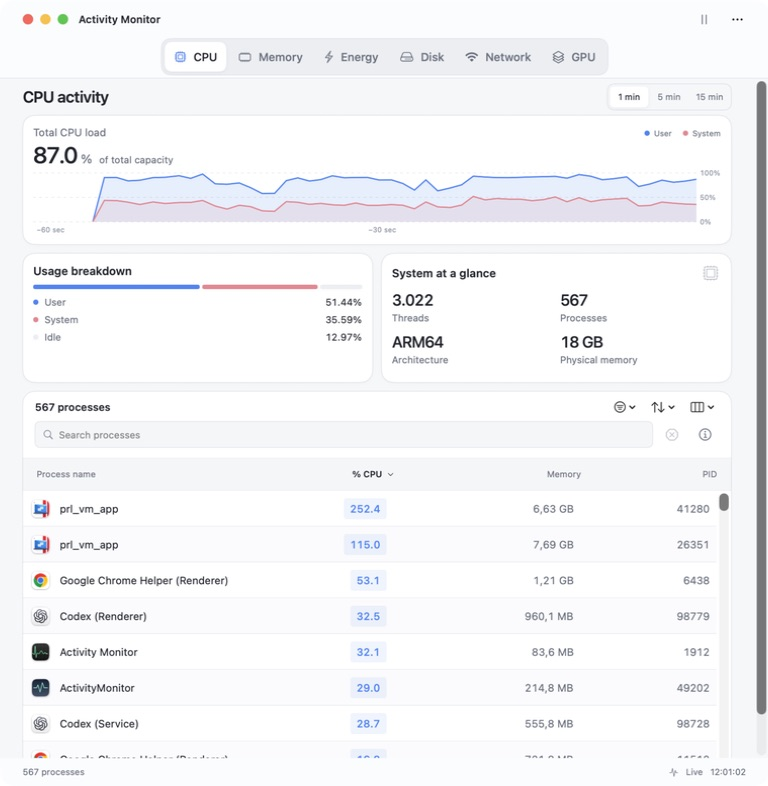 | 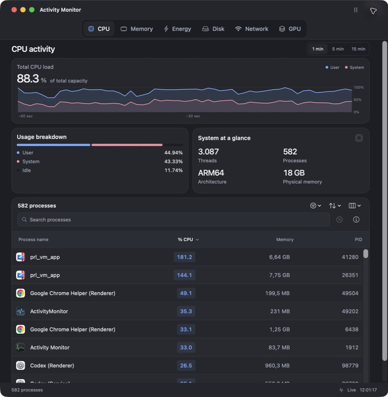 |

| Compact workspace | Menu bar · Light | Menu bar · Dark |
| :---: | :---: | :---: |
| 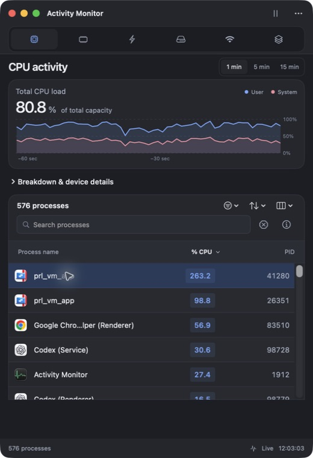 | 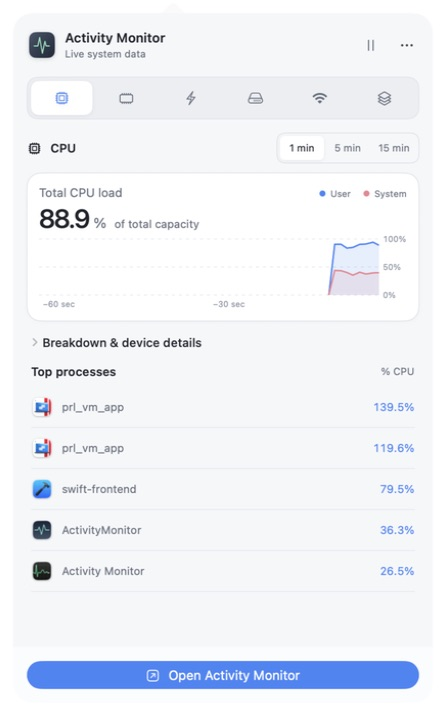 | 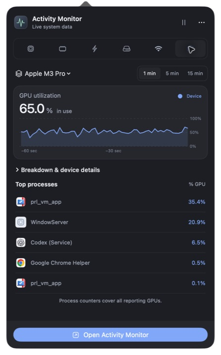 |

## A closer look at graphics

Track graphics and compute activity in the GPU view. Choose a device for its utilization history and memory details, then sort processes by GPU usage or observed GPU time. The inspector puts GPU, CPU and memory figures together. Export a GPU snapshot with device details and history from the More menu.

| Light | Dark |
| :---: | :---: |
| 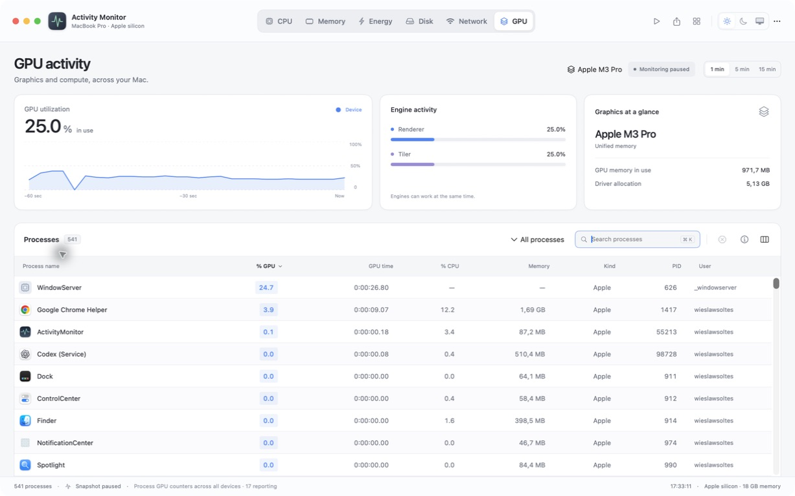 | 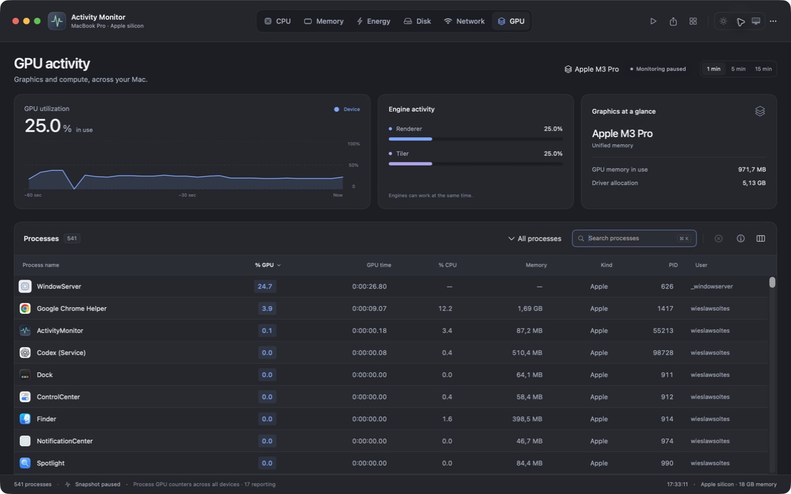 |

GPU availability depends on your Mac and its driver. Process counters cover all reporting devices; observed GPU time begins when monitoring starts. Device utilization and process GPU rates measure different things, so process percentages need not add up to the chart.

## Smoother everyday monitoring

Tabs respond across their full bounds. Clear hover, press and search-focus feedback makes controls easier to use, while a lighter process table reduces the work needed to switch views. Monitoring updates every second by default, with two- and five-second options. See the [profiling results](docs/performance/README.md).

## Installation

1. Download the **universal DMG** from the [latest release](https://github.com/wieslawsoltes/ActivityMonitor/releases/latest).
2. Open the disk image and drag **Activity Monitor** into **Applications**.
3. Open Activity Monitor from Applications.

Requires **macOS 14 or later**. The same download supports **Apple silicon and Intel**. A ZIP containing the complete app is also available. This app is separate from Apple’s built-in Activity Monitor.

**First launch:** Current releases are ad-hoc signed and not Apple notarized. If macOS blocks a downloaded copy, attempt to open it, then use **System Settings → Privacy & Security → Open Anyway** if you trust the source. No security setting needs to be disabled.

To uninstall, quit the app and move it from Applications to the Trash. See [installation notes](INSTALL.md) for details.

## Keyboard controls

| Shortcut | Action |
| :--- | :--- |
| **⌘1–⌘6** | Switch views |
| **⌘K** | Search processes |
| **Space** | Pause or resume |
| **↑ / ↓** | Select a process when the list is focused |
| **Return / Escape** | Open or close the inspector when the list is focused |
| **⌘⇧E** | Export all processes as CSV |
| **⌘⇧M** | Open the menu-bar monitor |
| **⌘⌥1 / ⌘⌥2 / ⌘⌥3** | Compact / minimum / default window size |
| **← / →** | Inspect samples when a chart is focused |

The toolbar export button saves the current filtered and sorted list.

## Your data stays on your Mac

No accounts, telemetry or uploads. Reports and exports are saved to a location you choose. No administrator helper is installed.

The CPU overview and process list use 100% per logical processor. The total, breakdown, and chart scale to the full machine capacity: 400% for four logical processors or 1600% for sixteen.

macOS restricts some process information; unavailable values appear as **—**. The Energy view shows **CPU workload**, not Apple’s proprietary Energy Impact score. GPU counters appear where the graphics driver exposes them. App Nap, Sudden Termination and Apple’s Energy Impact score display **—** when selected. [Column details and availability](docs/process-columns.md) explain each measurement. Disk totals cover readable processes; network totals can differ from individual process counters. Histories begin at launch and stay in memory for up to fifteen minutes.

[Measurement details](docs/METRICS.md) · [Report an issue](https://github.com/wieslawsoltes/ActivityMonitor/issues) · [Development guide](DEVELOPMENT.md)

## Design

The interface is based on this [original design](https://chatgpt.com/share/6a9c6a89-70e0-83eb-a977-4ca6e6f34766).
