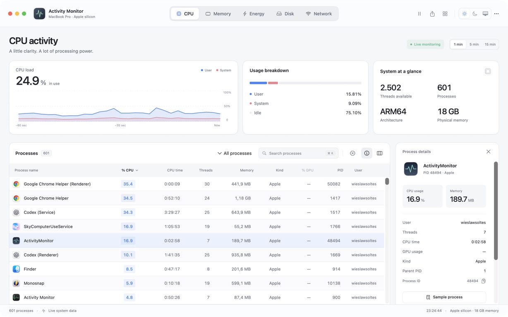
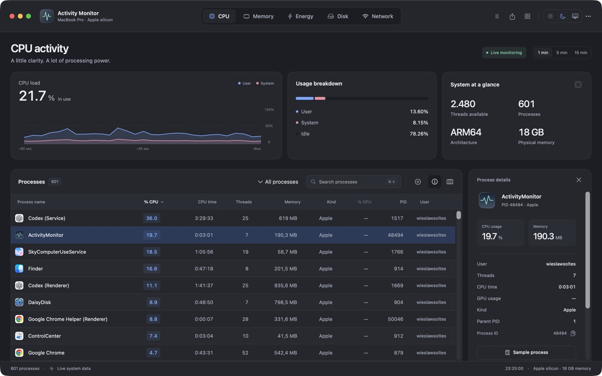

# Activity Monitor for macOS

A native SwiftUI activity monitor inspired by the supplied five-view design. Runs on macOS 14 or later, on Apple silicon and Intel. Uses live system data, native SwiftUI Canvas charts, public Darwin/IOKit APIs, and the bundled macOS network accounting tool. No third-party dependencies, web view, administrator daemon, or telemetry.

## Screenshots

Actual running app with live system data and the process inspector.

### Light appearance



### Dark appearance



## Install

Open `dist/ActivityMonitor-1.0.0-universal.dmg` and drag **Activity Monitor** to **Applications**. A ZIP and the standalone `.app` are also in `dist/`. This app has its own bundle identifier and does not replace Apple's system utility.

The generated local release is **ad-hoc signed, not notarized**. See [INSTALL.md](INSTALL.md) for first-launch and uninstall instructions. Public distribution without a Gatekeeper exception requires a Developer ID Application certificate and Apple notarization credentials.

## Features

- CPU: live user/system/idle usage, process CPU percentage and accumulated CPU time, thread counts, physical memory and architecture.
- Memory: active, wired, compressed and inactive memory, physical RAM, swap and kernel memory-pressure status; processes sorted by memory.
- Energy: battery charge history, adapter/charging state, Low Power Mode and thermal state; CPU workload as an explicitly identified alternative to unavailable Energy Impact scores.
- Disk: per-process lifetime bytes read/written and sampled throughput for readable processes.
- Network: 64-bit interface byte and packet totals, mirrored received/sent throughput history, and per-process received/sent bytes from `nettop` (updated every five seconds).
- Search names, PIDs and users. Filter all, personal, root-owned or application processes. Sort all displayed columns numerically where appropriate. Choose optional columns; preferences persist.
- Inspect process CPU, memory, parent PID, threads and I/O. Copy PID, reveal executable in Finder, inspect open files/ports, capture real one-second stack samples and save diagnostic reports.
- Quit or Force Quit owned processes with confirmation and PID/start-time identity validation. The app, PID 0/1 and other users' processes are protected.
- One-, five- and fifteen-minute history ranges, chart selection, pause/resume and 1/2/5-second refresh intervals.
- Light, dark and system appearances using the reference design tokens; live view/theme gallery; optional menu-bar CPU monitor; CSV and JSON process exports.

## Data semantics and limits

Process enumeration uses `KERN_PROC_ALL`; protected processes remain listed even when macOS denies access to detailed counters. Such counters display **—**, and CSV exports leave the corresponding cells empty. JSON includes `accessible` and `ioAccessible` flags; ignore numerical placeholders when the relevant flag is false. Some protected process names are truncated by the kernel.

Process CPU time is converted from Mach absolute ticks to seconds using the machine's timebase. CPU percentage is a delta over the sampling interval and may exceed 100% for multi-core processes. The first sample has no CPU/rate baseline. System CPU is normalized over all processors. Thread counts cover readable processes.

Memory used is active + wired + compressed physical pages. Inactive pages are shown separately as cached/inactive. These categories are not a reproduction of Apple's private App Memory accounting. Process memory prefers physical footprint, falling back to resident size. Shared pages mean process totals do not necessarily sum to physical usage.

Disk totals are process-lifetime counters, not whole-device totals. Throughput excludes processes that exit between samples and processes whose counters cannot be read. Per-process network bytes use Apple's `nettop -P -L 1 -n -x -J bytes_in,bytes_out` output and refresh every five seconds. Processes without observed network accounting show —. These counters follow the connections available to nettop and may differ from interface totals. Network interface totals aggregate non-loopback interfaces since their creation; VPN/bridge traffic may be counted at multiple interfaces. Interface removal/reset can interrupt a rate interval. Histories remain in memory for fifteen minutes and begin at app launch; pausing stops collection.

Apple's proprietary per-process Energy Impact, 12-hour power, App Nap, GPU usage, and per-process packet counts are not implemented or fabricated. Sampling and open-file inspection may be denied for protected processes. This app does not elevate privileges or bypass macOS protections.

Exports and reports are written only to a user-chosen local location. `sample` may also create its standard temporary report under `/tmp`. No monitoring data is transmitted.

## Build and package

Requires Xcode with the macOS SDK and Swift 5.9 or later. Open `Package.swift` in Xcode, or:

```sh
swift build
swift test
./scripts/package.sh
open "dist/Activity Monitor.app"
```

The packaging script builds a universal binary, creates the app bundle and icon, signs it, and emits a compressed DMG, ZIP and SHA-256 checksums. The DMG includes an Applications shortcut and installation notes. Generated artifacts are ignored by Git.

For a notarized release, configure a Developer ID Application identity and an existing `notarytool` keychain profile:

```sh
SIGNING_IDENTITY="Developer ID Application: Your Name (TEAMID)" \
NOTARY_PROFILE="your-existing-notary-profile" \
./scripts/package.sh
```

The optional path signs with hardened runtime, submits the DMG and staples its ticket. It requires your own Apple credentials; none are stored in this repository. The ZIP is an alternative archive of the signed app; the script's stapled artifact is the DMG.

## Keyboard shortcuts

| Shortcut | Action |
| --- | --- |
| Command–1 … Command–5 | Switch views |
| Command–K | Focus process search |
| Space | Pause or resume |
| Up / Down with process list focused | Select previous / next process |
| Return with process list focused | Open inspector |
| Escape with process list focused | Close inspector |
| Command–Shift–E | Export all processes as CSV |

The toolbar export button exports the current filtered/sorted list. The app menu shortcut exports all processes. The More menu contains appearance, update interval, menu-bar visibility, JSON export and help.

## Structure

- `Sources/SystemBridge`: small C bridge for kernel process enumeration, libproc counters, host CPU/VM statistics, 64-bit interface statistics and IOKit battery information.
- `Sources/ActivityMonitor/Monitor.swift`: background sampling, counter deltas, bounded histories, serialization and validated process termination.
- `Sources/ActivityMonitor/ContentView.swift`: fixed dashboard shell, custom toolbar, theme controls and diagnostics.
- `Design.swift`, `Overview.swift`, `ProcessTable.swift`, `Inspector.swift`, `Gallery.swift`: reference-matched visual components, charts and view gallery.
- `NetworkCollector.swift`: bounded nettop collection and CSV parsing.
- `Sources/ActivityMonitor/ActivityMonitorApp.swift`: window, commands and optional menu-bar item.
- `Tests/ActivityMonitorTests`: live collector, CPU accounting, export and disposable-process termination tests.
- `scripts`: deterministic icon generation and universal release packaging.

See [QA.md](QA.md) for verification and its limits.

## Visual refinement

The native interface uses the supplied HTML design's semantic light/dark tokens, 78-point toolbar, 1.82:1:1 overview card proportions, 213-point overview height, 41-point process rows, 14-point card radii, blue metric highlights and a 298-point inspector. The dashboard stays fixed while process rows scroll. Each view has its own reference heading, summary arrangement and column set. Disk/network plots mirror incoming and outgoing activity around the baseline. Memory pressure displays the kernel's categorical pressure level. Process icons resolve the enclosing app bundle for helper processes. Unavailable metrics retain their column positions and use explicit dashes.

## Continuous integration and releases

GitHub Actions builds and runs the test suite on macOS 15 Apple silicon and Intel. After both pass, CI builds and verifies the universal app, DMG and ZIP, and retains the complete installer artifacts for 30 days. Pull requests, pushes to main and manual CI runs use the same reusable build workflow.

To release, first wait for green CI on the intended commit, then push a version tag such as `v1.0.1`. The release workflow validates the tag, repeats both architecture tests, builds versioned installers, verifies their contents and signatures, and publishes a GitHub release only after all checks succeed. It attaches the DMG, ZIP containing the full app bundle, portable SHA-256 checksums and installation notes. Failed builds do not publish a release.

Hosted builds use ad-hoc signing without credentials. Developer ID/notarization remains available through the local packaging script. Release publication needs only the workflow's scoped GitHub token; pull-request builds have read-only repository permissions.
