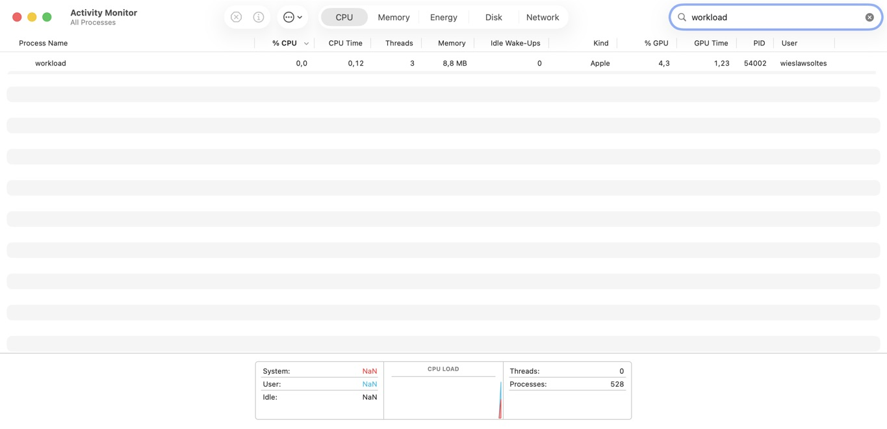

# GPU validation

September 9, 2026 · macOS 26.6 · Apple M3 Pro · Xcode 26.4.1 / Swift 6.3.1.

## Design before implementation

The [design specification](design/GPU.md) and [light/dark design study](design/gpu-preview.html) were committed before collector or UI implementation (`9c7d4ef`, `5b8b6ae`). Mockup values are illustrative. The [product screenshots](screenshots/README.md#gpu-preview) show the running app and real counters.

## Counter units and independent comparison

A controlled Metal compute workload (PID 54002) exposed `AppUsage[].accumulatedGPUTime` through its accelerator client. The sum was **1,233,367,625**, which converts to **1.233367625 seconds** when interpreted as nanoseconds. Apple's Activity Monitor showed **GPU Time 1.23** for that same process:



After a warmup baseline, the workload produced 1.226279417 seconds of driver GPU time. The same workload's command buffers reported 5.614813249791041 seconds between Metal GPU start/end timestamps. These are different measures; the application does not equate or calibrate one to the other. The independent Apple display validates the driver-counter conversion on this hardware. Driver behavior and timing under other workloads can differ.

Reproduce without administrator privileges:

```sh
swiftc Sources/ActivityMonitor/GPUCollector.swift scripts/gpu-workload.swift -o /tmp/activity-monitor-gpu-workload
/tmp/activity-monitor-gpu-workload --hold
```

The program runs 100 compute submissions and prints its PID, total driver time, observed delta and Metal elapsed time. `--hold` keeps it alive for two minutes so you can search for its PID in Apple's Activity Monitor and inspect GPU Time. Leave off `--hold` for a shorter run. It reports failure if Metal execution fails or counters do not advance. No equality assertion between driver and command-buffer time is appropriate.

## Scope and limitations

- Live M3 Pro device identity matches Metal registry ID `4294968698`. Device, renderer, tiler and memory counters are present. Real WindowServer GPU counters remain visible even though ordinary CPU/memory access is restricted.
- The test suite covers optional values, monotonic rates, warmup, counter and queue changes, PID reuse, duplicates, device separation/disconnection, graph gaps, sorting, exports and alternate device-utilization keys.
- Metal ancestor matching and alternate `GPU Activity(%)` parsing are covered by synthetic fixtures. A physical Intel Mac or eGPU was not available for runtime validation; unsupported driver counters are shown as unavailable.
- The sampling path uses IOKit directly. A 30-second observation of the initial release build with GPU selected measured 4.4968% process CPU, with RSS moving from 129,216 to 130,208 KiB. Sampling interval: two seconds. The earlier version's idle observations were 4.53–4.70%; these are separate runs, not a controlled comparative benchmark.

[Measurement definitions](METRICS.md#gpu) describe partial client coverage, session time and the distinction between device utilization and process rates.
