# Per-process diagnostics

Open **Process diagnostics…** from a process’s context menu or inspector. Use **Open in tool window** to keep it beside your main monitor. The window’s overlapping-rectangles button makes it float above other windows.

The workspace uses the same surfaces, typography, history controls and selection accents as the main monitor. Overview groups identity, access, CPU, memory and resource details. Activity pages pair a chart with process counters; table pages keep filters and exports above the list. Long paths wrap within their panels.

The workspace provides:

- **Overview:** executable and working directories, start time, identity and credentials, scheduling, virtual and resident memory, faults, syscalls, messages, wake-ups, resource counters, and parent/child navigation.
- **CPU, Memory, Energy, Disk, Network, GPU:** independent one-, five-, and fifteen-minute process histories plus the relevant counters. CPU uses 100% per logical processor. Memory is process footprint, not system memory pressure.
- **Threads:** unique thread IDs, names, scheduler CPU estimates, user/system times, state, priorities, scheduling policy, flags, and sleep duration. Older kernels can fall back to explicitly labelled thread handles.
- **Open files:** descriptors, type, path, size, offset, inode, device, flags, mode, and access status.
- **Connections:** TCP/UDP IPv4/IPv6 endpoints, listening/connection state, Unix sockets, kernel-control endpoints, and queued bytes.
- **Mach ports:** IPC names and rights where macOS permits enumeration, alongside the available total port count. These are distinct from network ports.
- **Fileports:** file descriptors exported as Mach ports.
- **Memory map:** addresses, size, resident/private/shared/swapped/dirty bytes, protection, maximum protection, share mode, VM tag, references, object, offset, and mapped path.
- **Mapped images:** executable file mappings. Libraries within the shared dyld cache may not appear individually; a virtual-memory report provides additional context.
- **Reports:** stack sampling, complete `lsof` output, `vmmap`, launch arguments, environment, code signature, and entitlements. Reports are collected only on request.

Diagnostic tables initially show a compact selection of useful columns and fit the available window width. Right-click any column header to show extra fields, fit the current columns to the window, or restore the defaults. Manually resized columns retain their widths; horizontal scrolling remains available for wider custom layouts. Numeric values align to the right, and hovering reveals complete values and paths. Search and CSV exports include hidden fields.

Tables support column resizing, double-click fitting, drag reordering, sorting, header-menu visibility, multiple selection, keyboard navigation, ⌘C, and Finder reveal for file paths. Column layouts are remembered separately per diagnostic table. Filter and export tables as CSV, save reports as text, or export the collected process snapshot, history and reports as JSON.

## Memory visualizations

The **Memory** page includes a fifteen-minute composition chart and a current/peak list
for physical footprint, resident pages, private and shared resident pages, compressed
bytes and purgeable bytes. Footprint is the primary process-memory comparison and comes
from `proc_pid_rusage`; the other series are native diagnostic counters that can overlap
or be unavailable when macOS denies task or region inspection. The chart keeps missing
series as gaps and the list labels unavailable values with `—`.

The **GPU** page includes a fifteen-minute chart of driver-reported device memory in use
and allocated, followed by one row per visible GPU. Device totals describe the graphics
driver’s view of the machine and are not the selected process’s allocation. Public macOS
APIs do not provide a reliable per-process GPU allocation total, so the process row is
explicitly labelled unavailable; the GPU activity chart above remains per-process where
the driver publishes execution counters. Disconnected devices remain visible until the
session is closed, with their counters cleared.

**Memory map** offers two views: horizontal bars compare memory grouped by protection; **Address ranges** places the eight largest virtual mappings on a linear address axis. Each interval retains its true start, length and the gaps between mappings. Axis labels are offsets from the displayed base address. Small ranges may appear very thin beside large reservations; filter the table to inspect a smaller part of the address space.

**Mapped images** ranks the eight largest images with an **Other** bar accounting for the remaining images. Multiple executable mappings of the same full path contribute to one bar, while the table retains each address separately. Hover or select a bar to see its full path and size. A focused chart supports Up/Down inspection and exposes values to accessibility tools.

Choose **Resident** or **Virtual size** independently: resident pages are part of a virtual mapping, so these measurements are not stacked together. Both charts follow the table filter and its timestamped snapshot. Totals cover readable mappings, can include shared pages, and are not process footprint or on-disk file size. Unavailable sizes and partial collections are labelled. Shared-cache libraries may not appear individually.

The chart button hides or shows the visualization above the table. In compact windows it opens the chart in a popover, leaving space for the list.

| View | Light | Dark |
| :--- | :---: | :---: |
| Memory by protection | 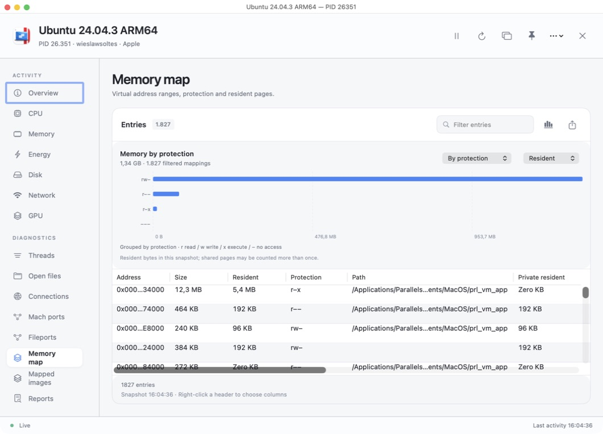 | 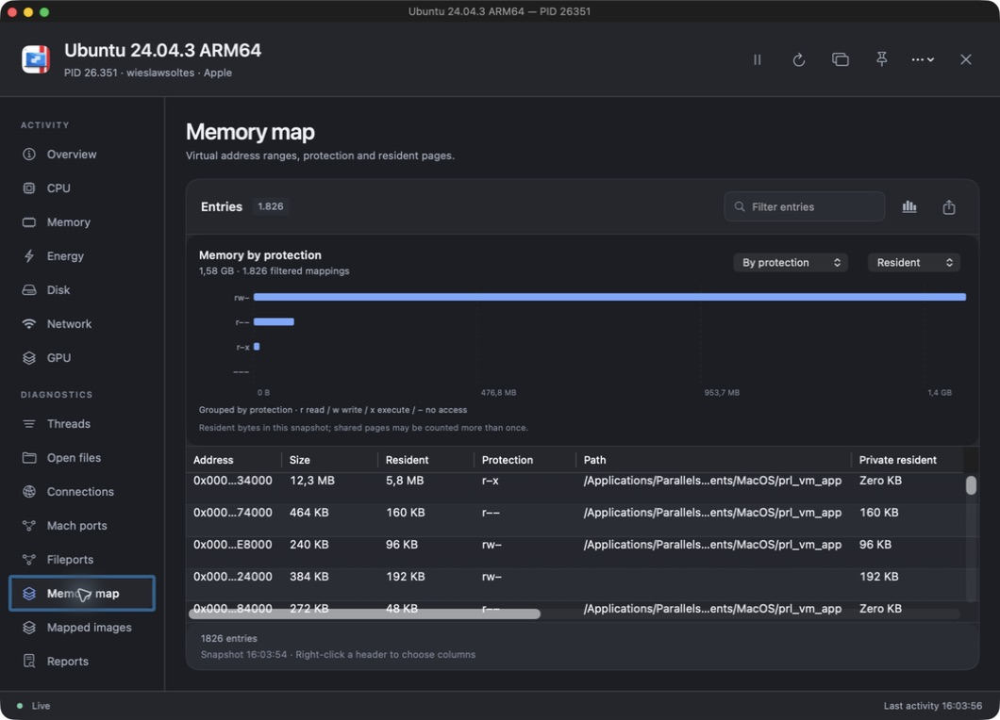 |
| Mapped image sizes | 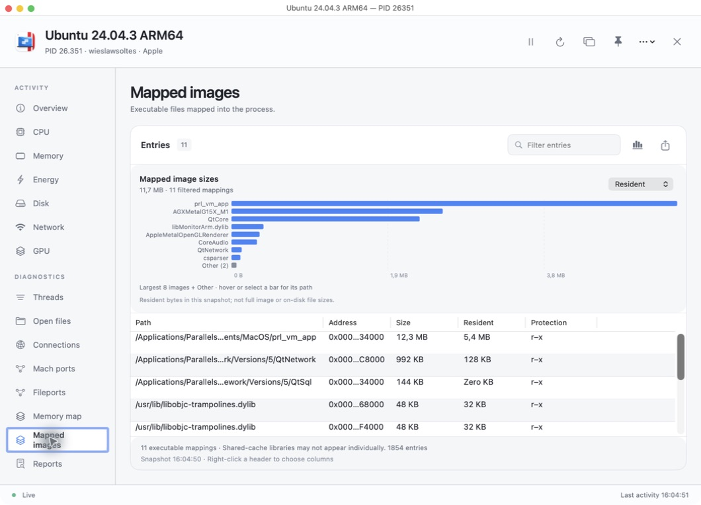 | 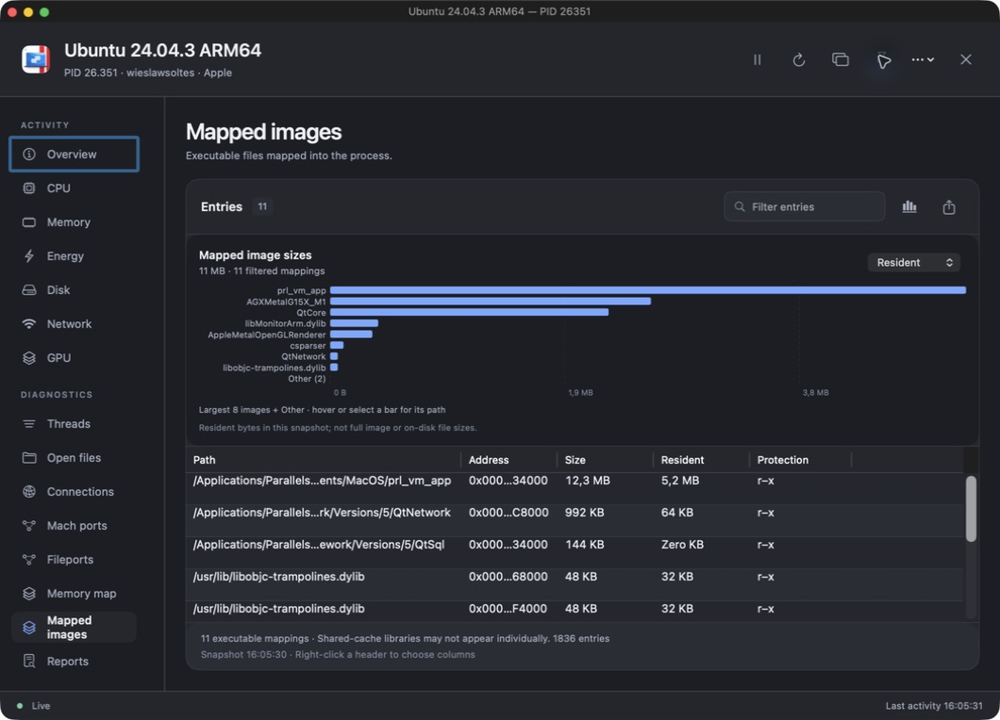 |

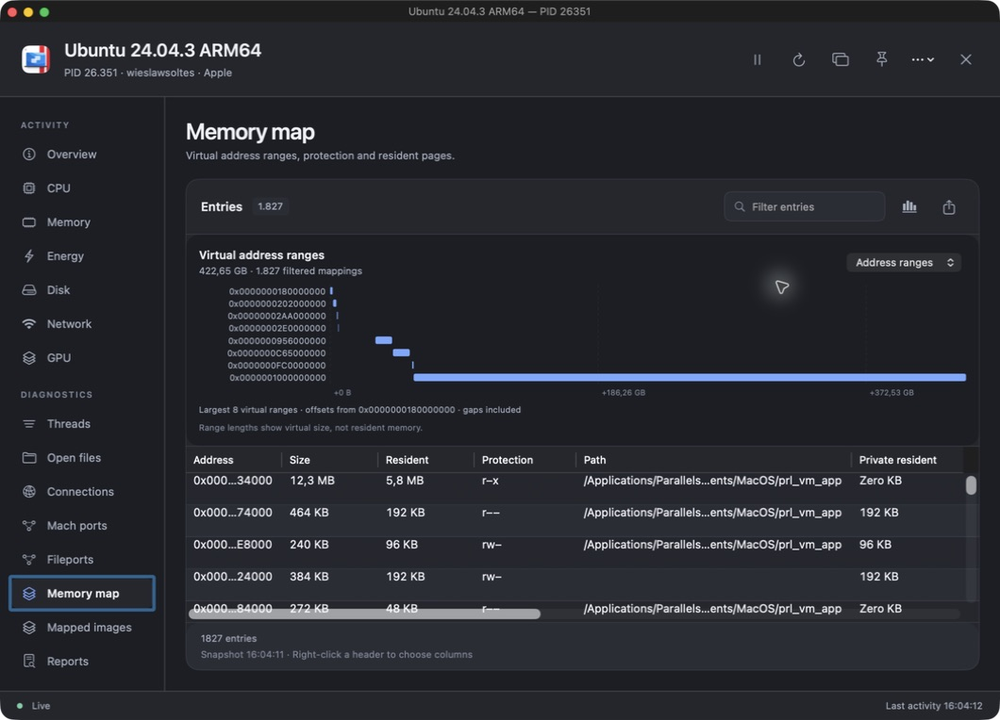

## Individual thread charts

CPU and Energy pages offer **One chart → Individual threads**, including in tool windows and process menu-bar pins. One chart remains the default. The selected mode, filter and pagination remain with the process session when its views are rebuilt or reopened while retained. The thread grid shows each thread’s name or unique ID, its current CPU usage and history. The grid fits all threads into the available viewport where legible, resizing as the count or window changes. Dense grids simplify labels; hover or select a tile for full identity, usage and an interactive chart. Filter to enlarge a subset. Very large collections scroll vertically once charts reach a usable minimum size, with **Paged charts** available as an alternative. Blue shows total CPU and pink shows system CPU. Threads can move between processors; these charts do not claim core affinity.

Collection begins when enabled and refreshes at most every two seconds, subject to the main refresh interval. Returning to One chart stops it. Both local and global pause freeze updates. Missing counters remain unavailable; newly observed threads need two readings. Histories are limited to fifteen minutes and a shared memory budget, which shortens retained history for very large thread counts. Exited threads disappear from the active grid. Collected thread histories are included in diagnostic JSON exports.

| Individual threads · Light | Individual threads · Dark |
| :---: | :---: |
| 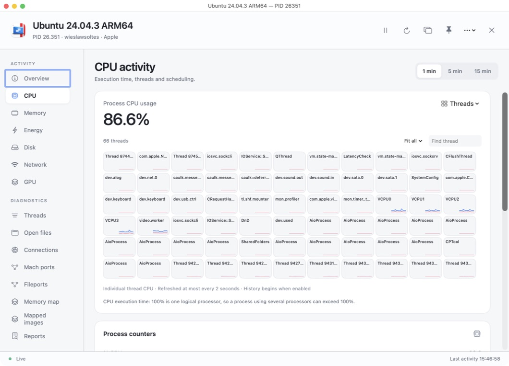 | 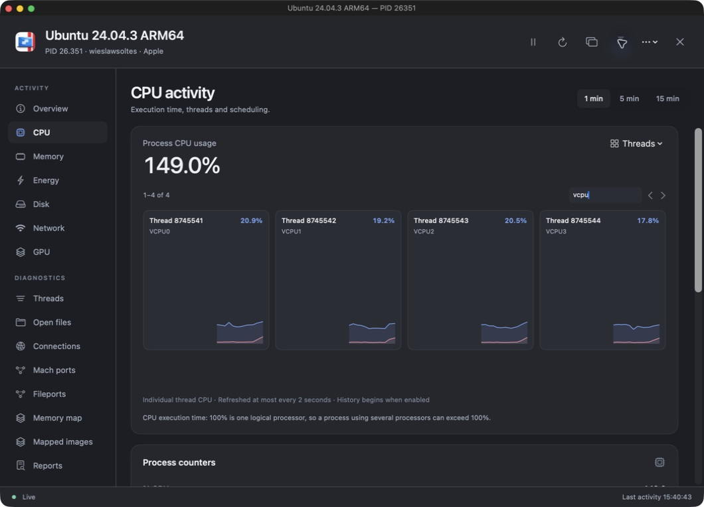 |

## Appearances

| View | Light | Dark |
| :--- | :---: | :---: |
| Overview | 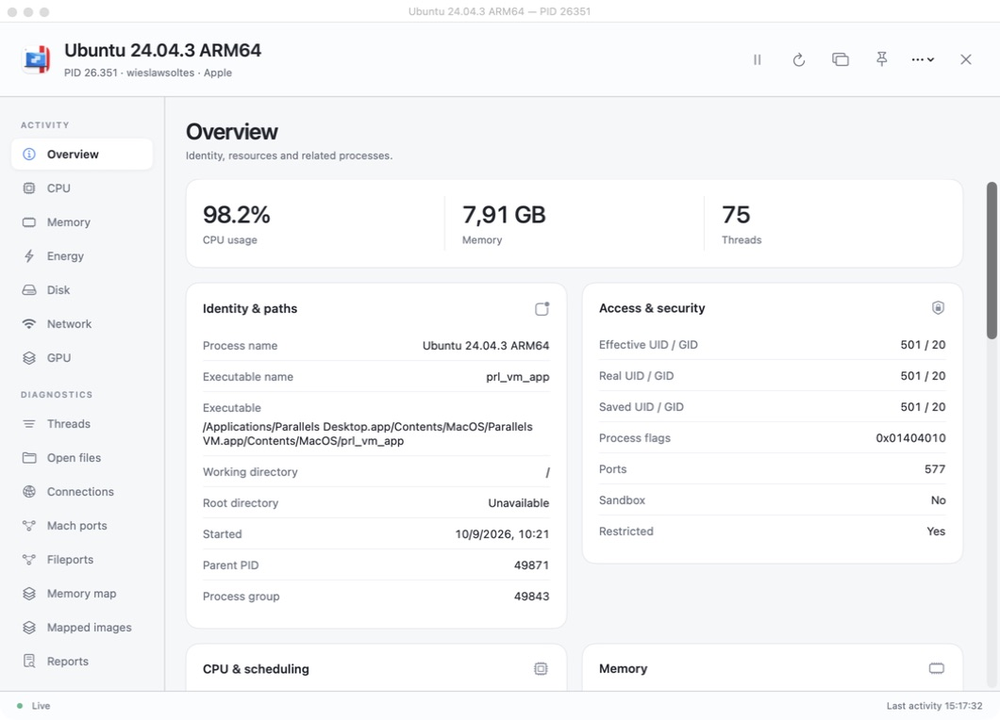 | 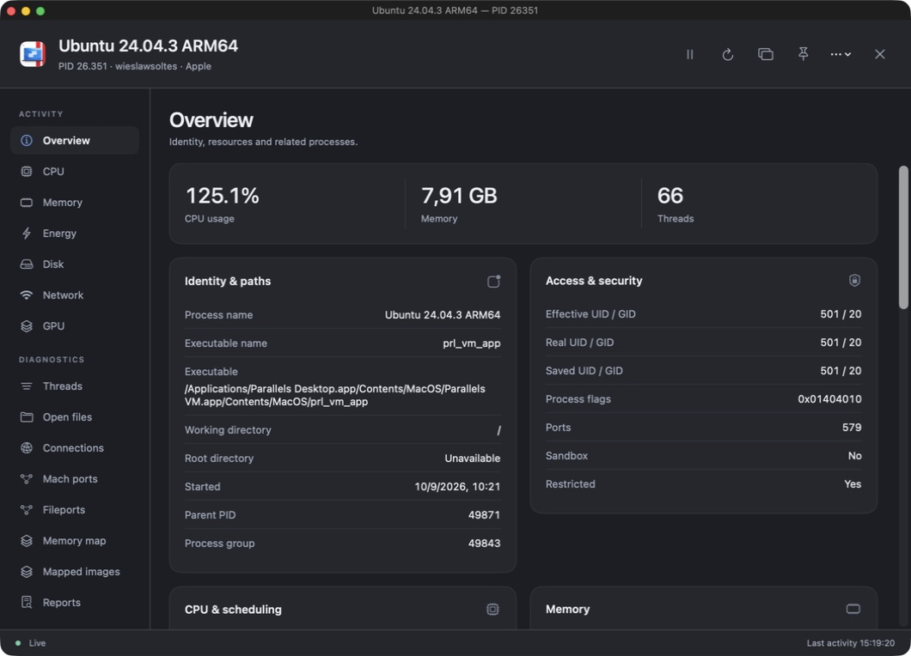 |
| CPU activity |  |  |
| Threads | 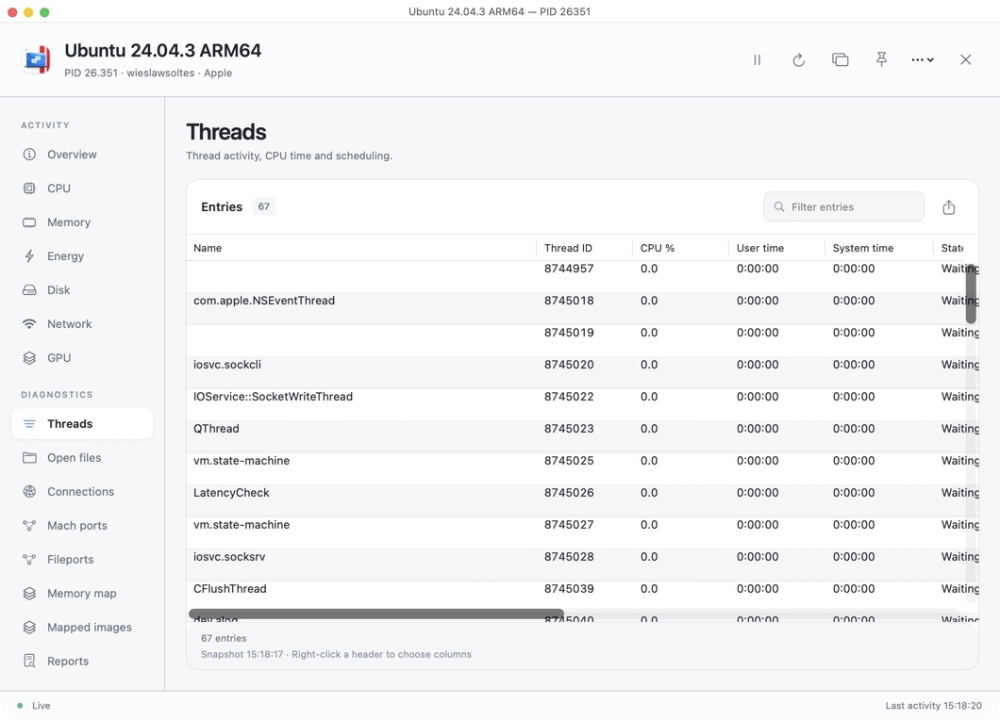 | 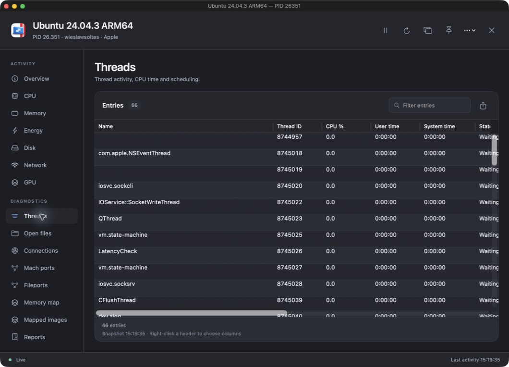 |
| Reports | 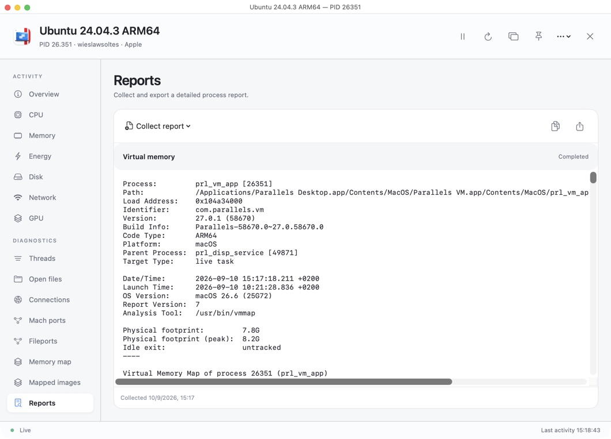 | 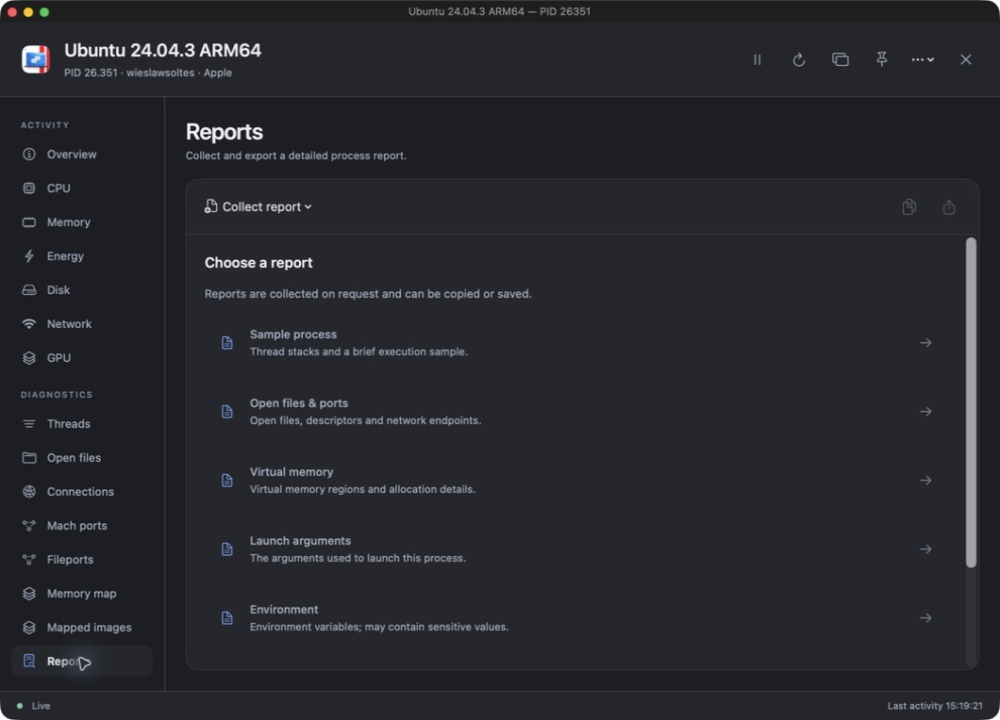 |

## Menu bar pins

Use the pin button to add a dedicated menu bar item for the process. Its popover has all six metrics, a chart, pause/resume, and **Open process monitor**. CPU is the default label; disk and network labels show read and receive rates. You can open the pin’s popover from **Process actions → Show menu bar monitor** as well.

A pin retains the process session after its dialog and tool window close. Unpinning the last surface releases the session and cancels pending reports. Pins are specific to this running app session and are not restored across launches; they never silently attach to a new process with a reused PID. Exited processes retain their last snapshot until their final surface is closed or unpinned.

## Collection and availability

The main monitor supplies activity at the selected global interval. Local pause freezes an individual session; global pause freezes activity for all sessions. Detailed information refreshes at most every five seconds while a dialog or tool window is open. Menu bar pins alone retain lightweight activity collection without continuing expensive detail scans, unless individual thread charts were explicitly enabled. Manual refresh is available while paused.

Only the currently selected detailed table is collected. Each table retains its own timestamp and last snapshot, so switching pages does not misrepresent an older snapshot as newly collected. Process identity is checked before and after collection; PID/start-time mismatches discard the result. A permissions failure is reported as unavailable rather than as an exit.

macOS protects some processes and counters. This app does not request root privileges or task-control rights. Mach-port enumeration can be denied even when Apple’s tools can provide the total. Apple’s Energy Impact, App Nap, and some GPU counters have no generally available equivalent; unavailable values remain `—`. Raw energy-accounting values have unspecified units and are not presented as watts or an Energy Impact score. QoS and resource time counters explicitly identify Mach ticks; thread CPU times are nanoseconds, converted to duration without applying the Mach timebase again.

Network counters are refreshed by the shared `nettop` collector approximately every five seconds. Charts show observed counter changes, which may appear as bursts. Histories begin when a process session opens and retain up to fifteen minutes, bounded to 3,601 samples. Detailed collections are bounded to 4,096 threads, 8,192 file descriptors/fileports, and 16,384 memory regions/Mach ports. A limit or partial read is labelled in the result.

Reports run without a shell, have a fifteen-second deadline and a 4 MB output cap, and can be cancelled. The report reader continues enforcing the deadline even if the tool closes stdout early. Process exit or identity changes discard tool output. Environment values are collected only through the explicit **Environment** report and may contain sensitive data; they are not part of launch-argument collection or automatic snapshots. Exports include the report currently selected by the user.

## Implementation and regression gates

`SystemBridge/ProcessDiagnostics.c` isolates the libproc and Mach bindings. `DiagnosticCollector` produces immutable, timestamped snapshots on utility workers. `ProcessDiagnosticSession` owns history and report state. `ProcessDiagnosticsCenter` shares sessions across reference-counted dialogs, tool windows and pins. Closing the last owner drops retained history and detail arrays; no per-process polling timer is created.

The UI shares the existing exact Canvas chart renderer and native chart inspection/Audio Graph accessibility, with process-specific labels and domains. Diagnostic tables use one `NSTableView` inside one `NSScrollView`, so scrollbars remain at the visible viewport edges. SwiftUI owns the shell and the inspector navigation; AppKit owns tool-window and status-item lifetimes.

Run:

```sh
swift test --filter ProcessDiagnostics
swift test
./scripts/performance.sh
```

The diagnostics suite covers live identity and thread units, file/inode and TCP endpoint collection, Mach ports, bounded memory-region traversal, rate reset semantics, process exit/reuse, argument/environment boundaries, report timeout/cancellation/output limits, shared-session lifetimes, all diagnostic pages in both themes and at two sizes, native table scrolling/selection, and permission-failure states. Existing headless and performance gates remain enabled.

Source references: Apple’s [libproc API](https://github.com/apple-oss-distributions/xnu/blob/main/libsyscall/wrappers/libproc/libproc.h), [public process structures](https://github.com/apple-oss-distributions/xnu/blob/main/bsd/sys/proc_info.h), [optional unique-thread-ID flavor](https://github.com/apple-oss-distributions/xnu/blob/main/bsd/sys/proc_info_private.h), [task and thread accounting implementation](https://github.com/apple-oss-distributions/xnu/blob/main/osfmk/kern/bsd_kern.c), and [Mach port names](https://developer.apple.com/documentation/kernel/1578814-mach_port_names). The optional thread-ID flavor falls back if unsupported; the app does not treat its private-header definition as a guarantee across future macOS releases.
