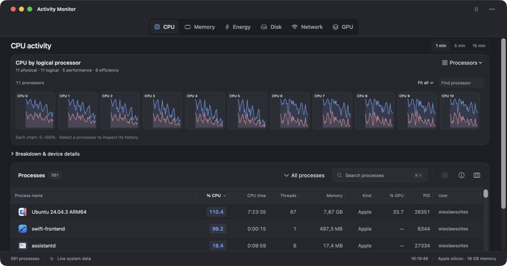

# Diagnostics and CPU scale validation

Validated on 10 September 2026, on an Apple silicon Mac with 11 logical processors and 18 GB memory.

## Automated checks

- `swift test`: 121 tests, zero failures; seven opt-in performance tests skipped in the normal run.
- Release performance run: all 22 measurement budgets and memory gates passed. The 15-minute diagnostic workspace measured 81.82 ms median / 87.77 ms p95; the 2,500-row diagnostic table measured 38.92 ms median / 38.93 ms p95.
- Performance gate tests: six passed. Packaging/notarization failure-path tests: six passed.
- Universal release build: arm64 and x86_64 compiled successfully.
- App signature, DMG integrity, ZIP contents, version, Applications link and SHA-256 checksums verified for the local 1.6.0 candidate. It is ad-hoc signed, not notarized or published.
- CPU regression fixtures cover 1, 4, 10 and 16 logical processors, full-load samples, matching headline/chart units, tick wrap, process PID reuse and uncapped per-process rates. GPU utilization remains on its independent 0–100% device scale.

## Native interaction checks

- Opened the real virtual-machine process in a dialog and a separate tool window; verified process identity and retained histories.
- Checked CPU above 100%, process memory in bytes, real thread IDs/times, file/network details and a completed code-signature report.
- Resized and reordered diagnostic table columns; both scrollbars remained at the viewport edges.
- Pinned a process, opened its popover, changed CPU to Memory, paused/resumed, and reopened the tool window. Closing the window retained the pinned session and its report.
- Verified light/dark appearances and captured the process workspace and host CPU overview. Automated rendering covers all 15 pages in both appearances at two sizes.
- Host CPU displayed values above 100% with an 1100% axis maximum on the local 11-logical-processor machine. A 16-processor fixture reaches a 1600% maximum.

## Design refinement

All 15 pages now share the main monitor’s theme, rounded panels, typography, history controls and hover feedback. Overview groups all collected fields without dropping unknown counters; activity pages show charts and process counters; the seven native tables share an entry/filter/export toolbar, viewport scrollbars and clear empty states. Reports provide a chooser and a separate reading surface.

After refinement, the full 103-test suite passed. The final focused rendering suite passed all pages in both appearances at 760 × 500 and 1060 × 740, including explicit checks that all seven tables are present. Native checks confirmed arrow-key sidebar navigation, a filtered-empty table, readable long paths, a completed memory report and both appearances. Updated screenshots are in the [user guide](README.md#appearances).

The universal 1.6.0 local candidate was rebuilt and its DMG/ZIP contents verified after these changes.

## Individual CPU charts

- Live host topology reports 11 physical/logical processors: five performance and six efficiency cores. Explicit IODeviceTree logical IDs match processor slot IDs; no classification is inferred from order.
- Seven CPU-detail tests cover independent tick baselines, nice time, counter wrap, missing/reappearing cores, thread resets and churn, opt-in/pause behavior, history budgets, live Mach buffer bounds and narrow/wide rendering in both themes.
- Native checks exercised logical processor selection and inspection, automatic thread grid fitting, filtering the live VM’s VCPU workers, separate user/system rates, and pause/resume in a process menu-bar pin. One combined chart remains the launch default.
- Histories are capped at 131,072 points per grid/session. Release performance gates cover appending 4,096 thread histories and rendering twelve and sixty-four charts with fifteen minutes of data (1.87 ms, 30.52 ms and 89.53 ms median respectively).
- Adaptive layout fixtures fit 1, 11, 16, 64, 67 and 128 charts into representative viewport sizes, enlarge filtered results, and retain a legible scrolling fallback for 4,096 threads. Native validation showed every live VM thread together and all eleven host processors inside the compact system popover. Optional Paged charts retained twelve tiles and working next/previous navigation.
- The full suite passed, followed by the focused CPU-detail suite and all release performance gates after the final grid layout refinement. The universal 1.6.0 candidate and DMG/ZIP were rebuilt and verified again.

## Mapping visualizations

- Five mapping tests cover independent resident/virtual totals, invalid and measured-zero values, repeated executable mappings, full-path grouping and Other totals, exact high-address offsets, overflow rejection, partial status, and rendering all three chart types in both appearances.
- The focused mapping and diagnostics UI suite passed eight tests after the final layout refinements. All fifteen diagnostic pages retain their tables at both tested window sizes.
- Native checks on a running VM exercised protection bars, virtual address intervals, Resident/Virtual size selection, path filtering, bar inspection and show/hide behavior. A compact 800 × 524 window opened the chart popover; arrow-key inspection selected the first image, and enlarging the window restored the inline chart. Two executable mappings of one library (48 KB each) correctly contributed 96 KB to its filtered virtual-size bar. Screenshots cover both appearances.
- Release performance with 16,384 mapping records measured 3.11 ms median / 4.18 ms p95 for aggregation and 30.35 ms median / 38.22 ms p95 for chart rendering. All 22 measurement gates passed.

## Adaptive CPU state retention

- Window-owned chart preferences survive the overview being reconstructed when workspace scrolling changes at adaptive width and height boundaries. The menu-bar monitor owns separate retained preferences; process sessions retain thread-grid filtering and pagination.
- Four regression tests cover resizing the actual main view across compact/standard/short/expanded sizes, default mode and retained settings, grid height budgets, balanced rows for uneven processor counts, and page resets only for explicit filter/layout changes.
- Native checks retained Logical processors, Paged charts and a Performance filter across narrow/wide resizing and a CPU → Memory → CPU round trip. Shortening a wide window retained all eleven charts and adapted the grid to a single row; restoring height returned the balanced six-plus-five layout.
- The final 121-test suite passed with seven opt-in performance tests skipped; all 22 release performance gates passed separately. The universal candidate was rebuilt and verified after the fix.

## Limits

Physical runtime validation was on Apple silicon. Intel was cross-compiled; it was not tested on physical Intel hardware. Access to another process’s Mach port names and some memory/GPU details remains subject to macOS permissions. Reports label collection failures and do not invent unavailable values. The optional unique-thread-ID kernel flavor has an explicit fallback to thread handles.

GitHub run `34484966162` on the preceding `09eb9eb` revision passed functional tests on Apple silicon but failed the existing table-refresh p95 budget (98.55 ms against 50 ms); the latest local run measured 17.44 ms. The updated revision requires a fresh CI result.

The candidate is intended for user validation before merge. No release tag or public release was created.
