# Activity Monitor screenshots

Version 1.1, captured from the running macOS app on September 6, 2026. Values are real process snapshots; paused views preserve the captured data. Click any image to view it at full size.

| View | Light | Dark |
| --- | --- | --- |
| CPU |  |  |
| Memory | 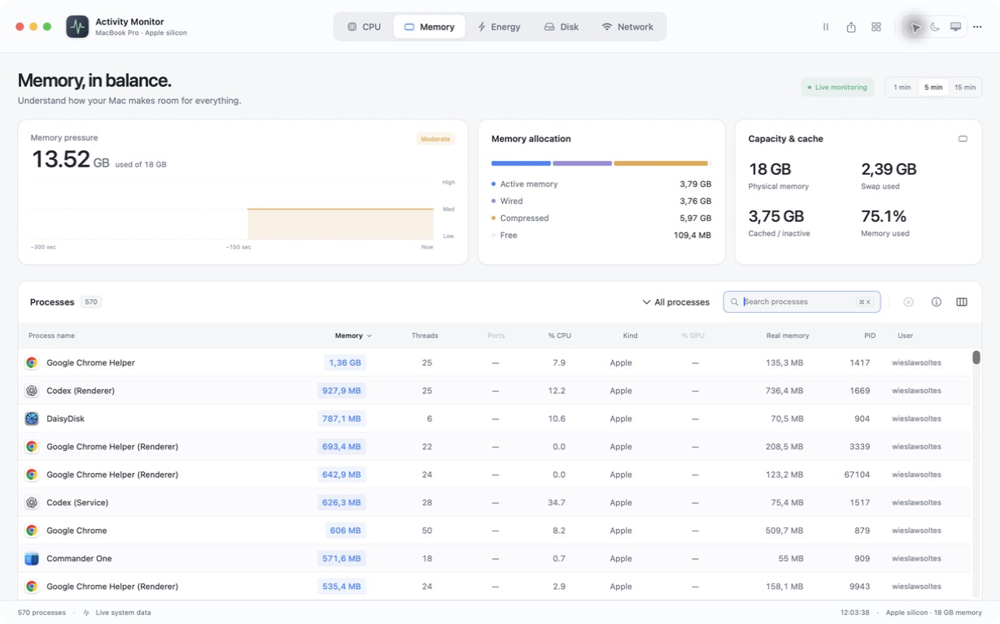 | 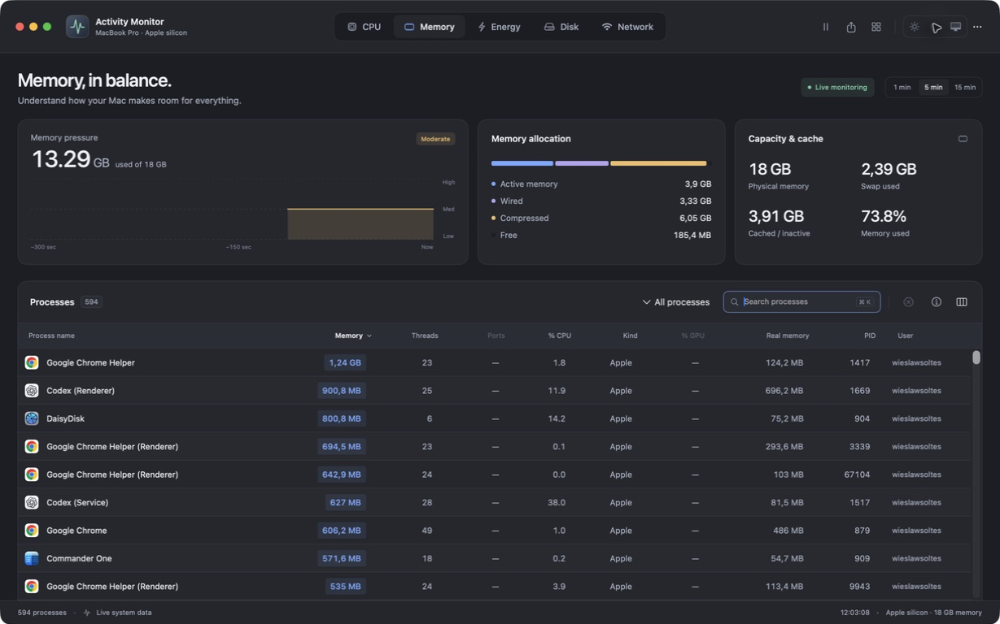 |
| Energy | 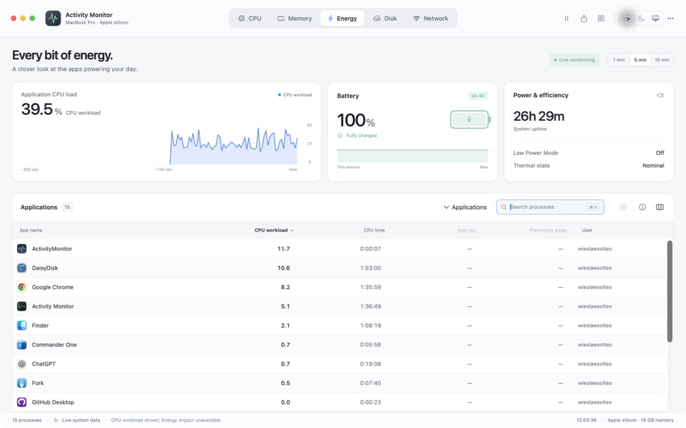 | 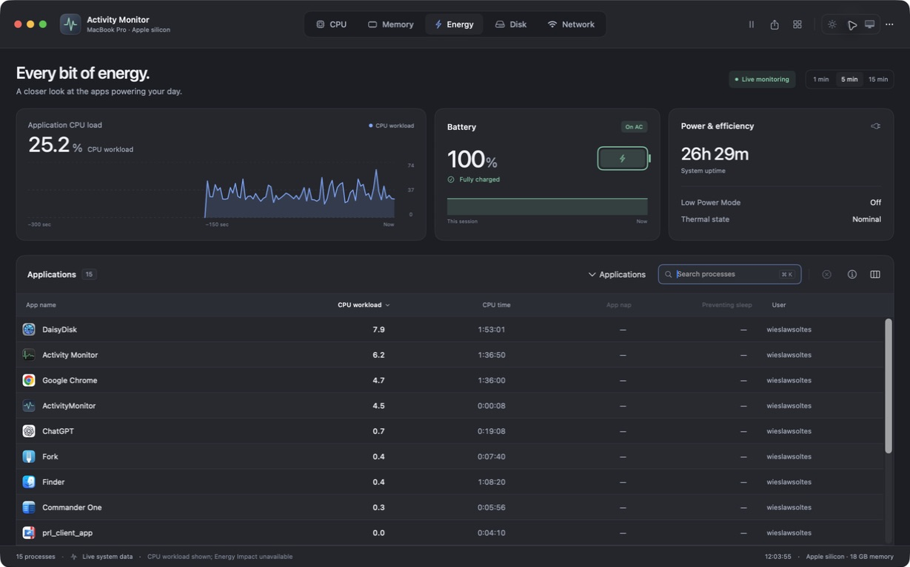 |
| Disk | 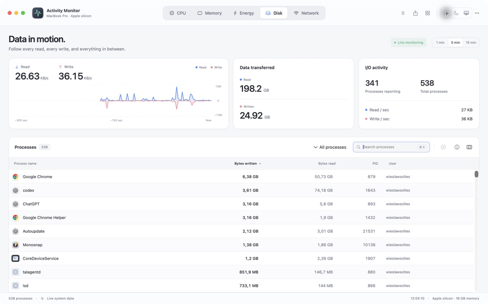 | 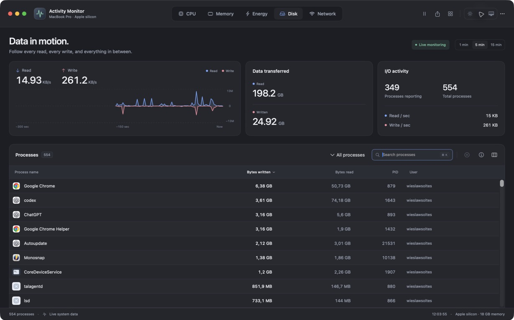 |
| Network | 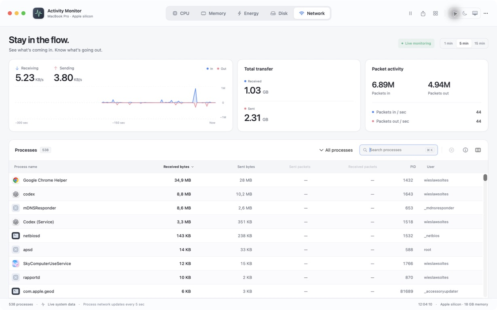 | 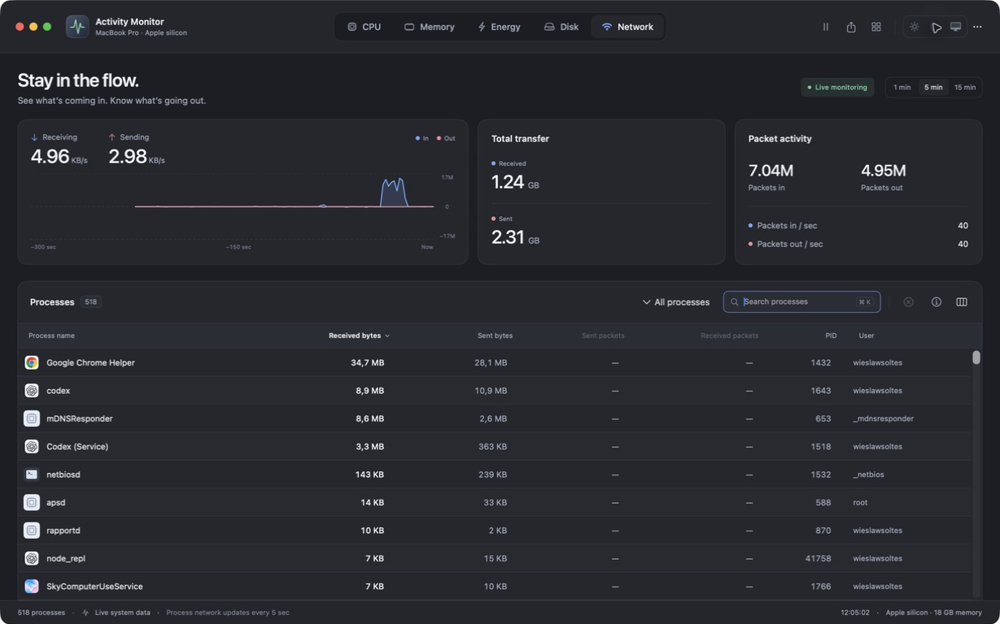 |
| Inspector | 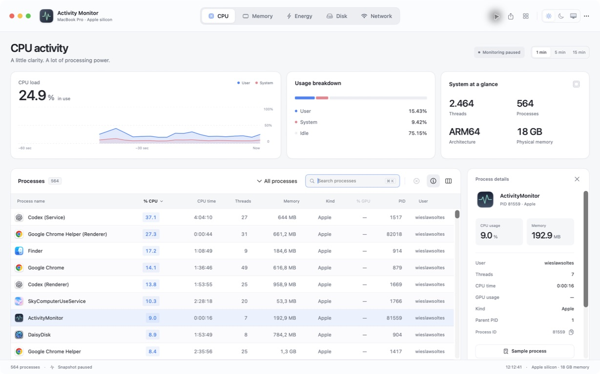 | 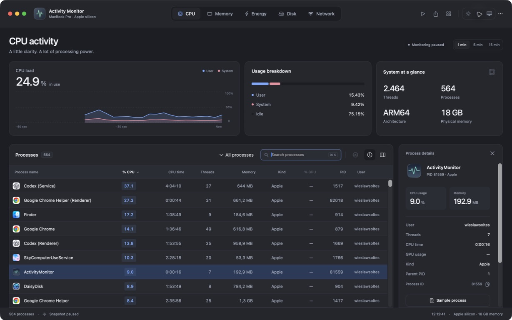 |

## Search focus

The focused search field has a blue outline that remains visible in either appearance.

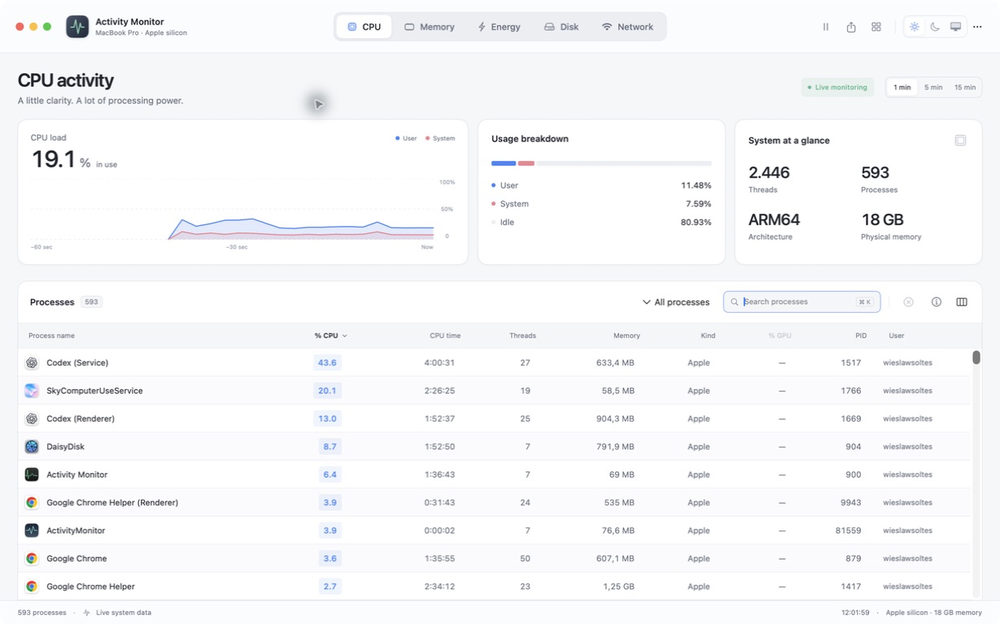

Based on the [original interface design](https://chatgpt.com/share/6a9c6a89-70e0-83eb-a977-4ca6e6f34766).
