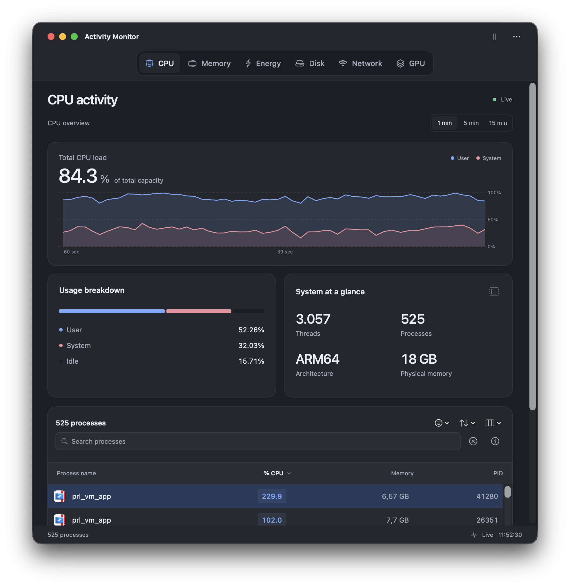
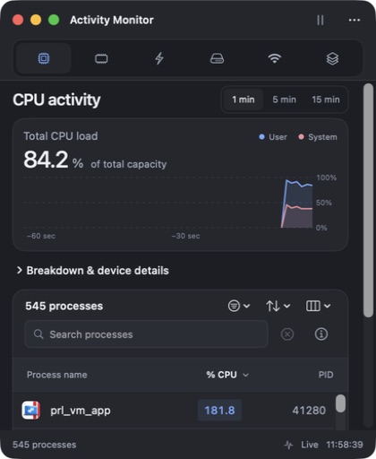
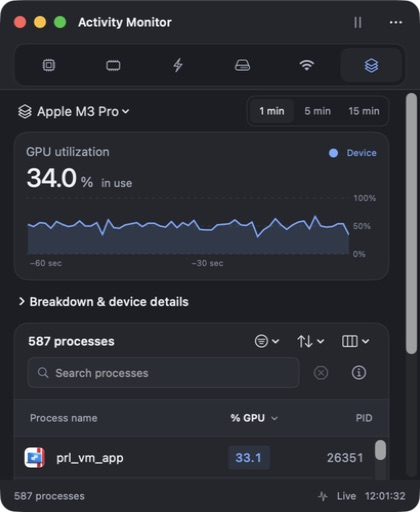
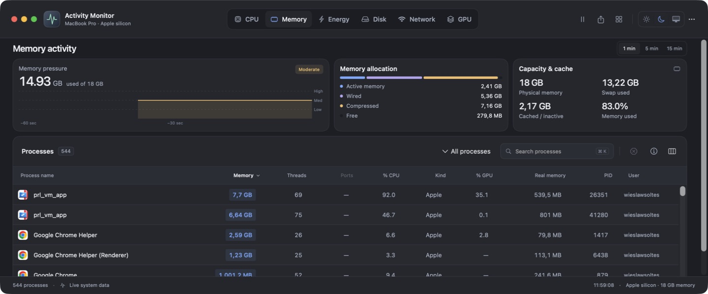
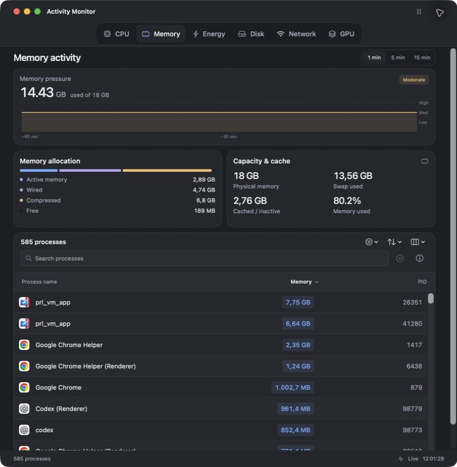
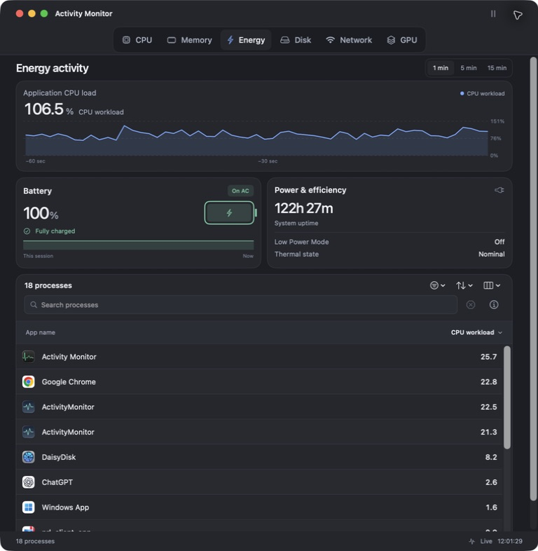
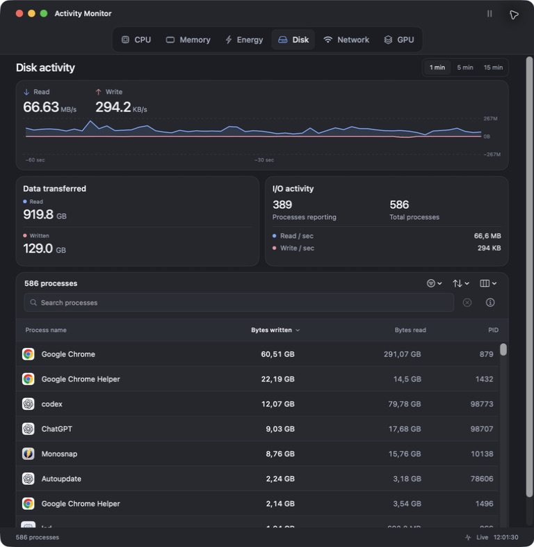
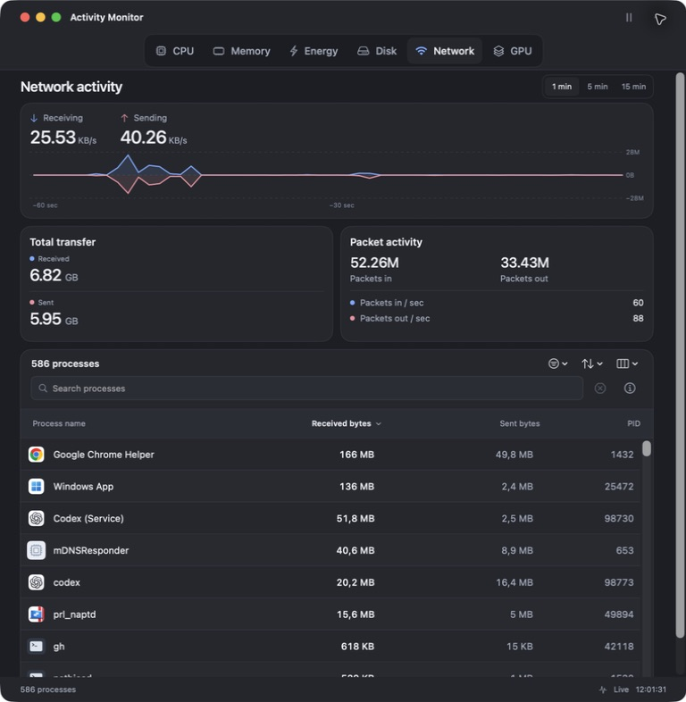
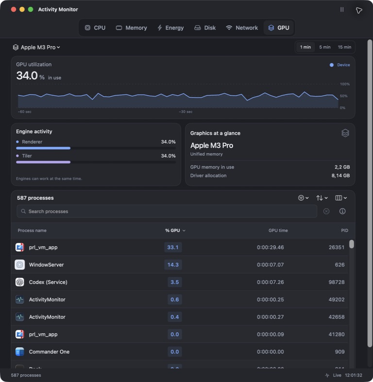

# Compact telemetry overview

Native macOS validation for Activity Monitor 1.3.2, September 10, 2026.

The medium-width overview previously used two 213-point panel rows plus a 14-point gap: 440 points before the process controls. It now uses two 148-point rows with a 10-point gap: 306 points, a reduction of 134 points (30%). Compact headings and toolbars save additional space. Wide, tall workspaces retain the original overview geometry.

| Reported layout | Updated layout |
| --- | --- |
|  |  |

## Verification

- All six metrics render their values, charts and detail panels at medium width without clipping.
- CPU and GPU both expose a complete process row at the minimum 420 × 480 content size before scrolling.
- A 520-point-wide window keeps several process rows visible, with expandable breakdowns. Memory allocation and GPU hardware/engine details were checked expanded.
- A short, wide window uses compact three-column panels. The default, tall workspace retains its 213-point overview; expanded geometry remains 280 points.
- Light and dark menu-bar monitors show all five top processes with collapsed details. GPU selection and history controls remain available.
- Native checks confirm switching between all six metrics, selecting a five-minute history, searching processes, selecting a row, and expanding/collapsing details.
- 38 Swift tests and six packaging failure-gate tests pass locally. Layout tests verify no overlap at breakpoints, compact overview height, and preservation of standard/expanded dimensions.

The screenshots contain real, changing system data. They are captured from a preview bundle using the application source; the package is separately verified for both architecture slices, metadata, signature integrity, archive extraction and checksums.

## Other sizes and views

| Narrow | Minimum | Minimum GPU |
| --- | --- | --- |
|  |  |  |

| Memory | Energy |
| --- | --- |
|  |  |

| Disk | Network |
| --- | --- |
|  |  |

