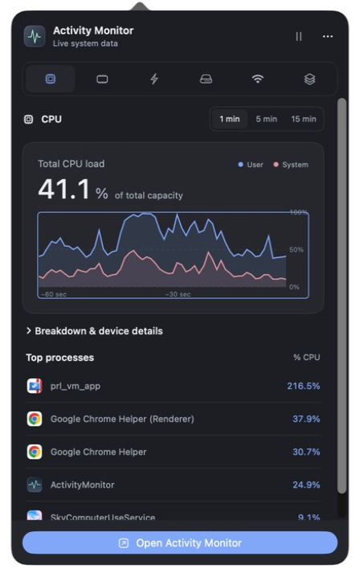
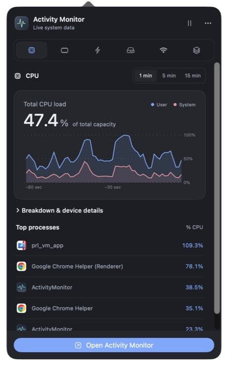
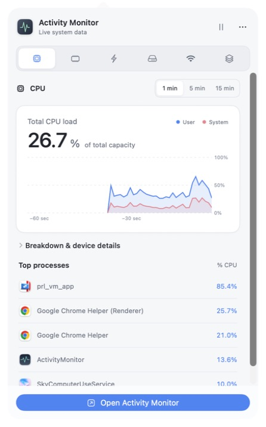
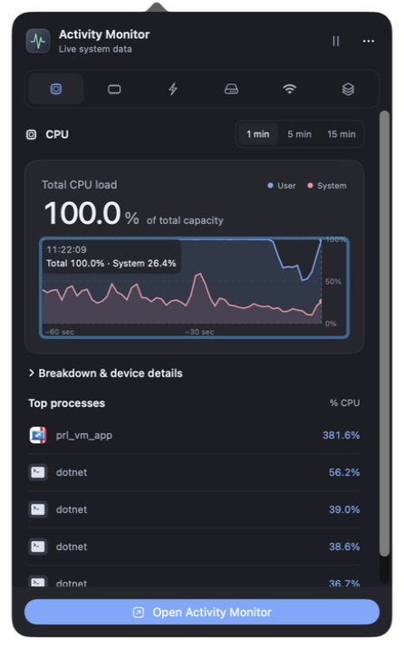
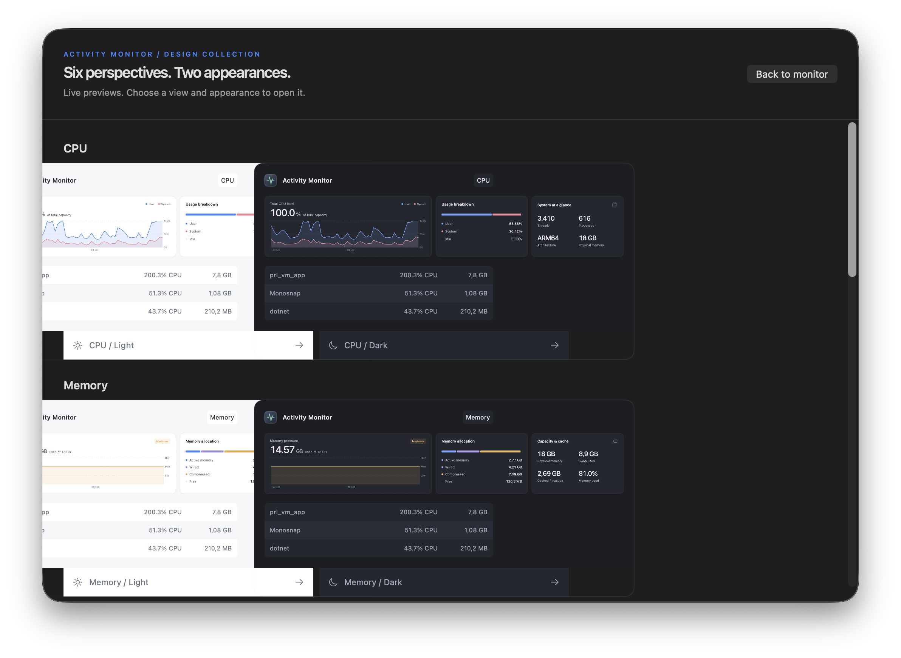
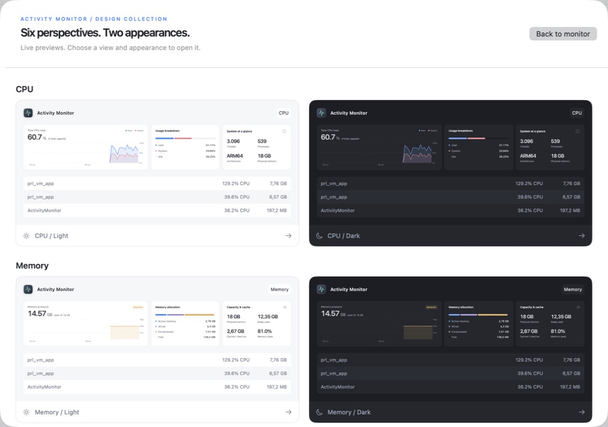
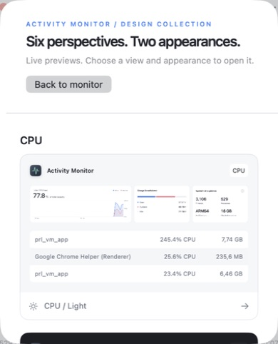

# Chart focus and perspective gallery validation

Native macOS verification for Activity Monitor 1.3.1, September 10, 2026.

## Chart focus

The previous chart opted into SwiftUI's default editing and activation focus and drew its own border whenever focused. Opening the menu-bar panel reproduced both automatic chart focus and the unwanted border. Activation-only focus now respects macOS Keyboard navigation; native focus indication remains available when navigating deliberately with the keyboard.

| Before | After |
| --- | --- |
|  |  |

Verified fresh startup and panel opening in light and dark appearances. With Keyboard navigation enabled, Tab reaches the chart and the arrow keys inspect samples in both the main window and panel. Escape clears inspection; a subsequent Escape closes the panel. With Keyboard navigation disabled, the chart does not take initial editing focus. The system preference used for testing was returned to restricted navigation afterward.

| Light panel | Deliberate keyboard inspection |
| --- | --- |
|  |  |

## Perspectives

The adaptive grid could allocate three tracks while its previews assumed two columns. A shared sizing contract now supplies one or two explicit tracks and matching card widths. Sheet dimensions come from the presenting SwiftUI geometry, and miniature charts cannot intercept input. Cards expose button roles and descriptive appearance labels.

| Before | After |
| --- | --- |
|  |  |

All six pairs were checked while scrolling the wide gallery. The minimum window displays a single column with a wrapping header and a visible Back button. Escape returns to the monitor. Clicking the GPU thumbnail opens GPU in Dark appearance.

Pointer selection opens the chosen perspective. Keyboard activation was verified by opening Memory in Light appearance. Automated layout tests cover the exact one-/two-column breakpoint and verify complete, non-overlapping occupancy across widths from 390 to 1800 points.

## Build validation

37 Swift tests and six packaging failure-gate tests pass. The universal package is checked for arm64 and x86_64 slices, version metadata, signature integrity, checksums, and matching executables after extracting the DMG and ZIP. These checks do not imply Apple notarization.
