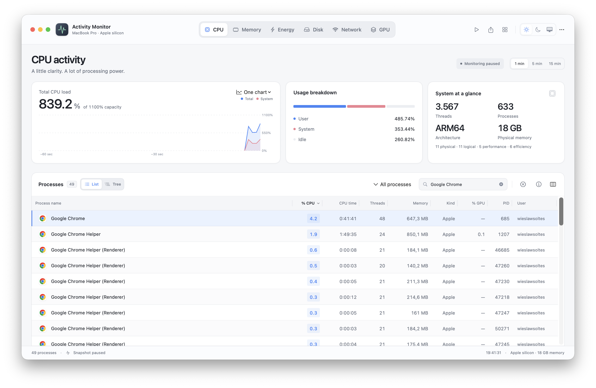
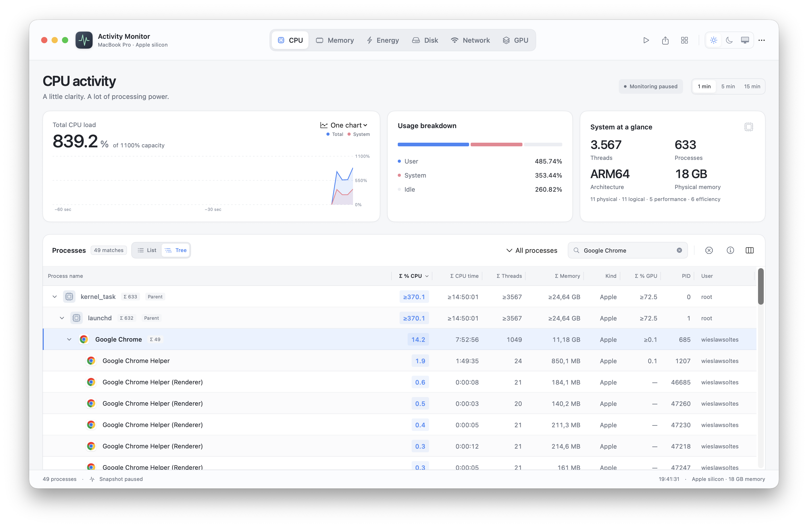
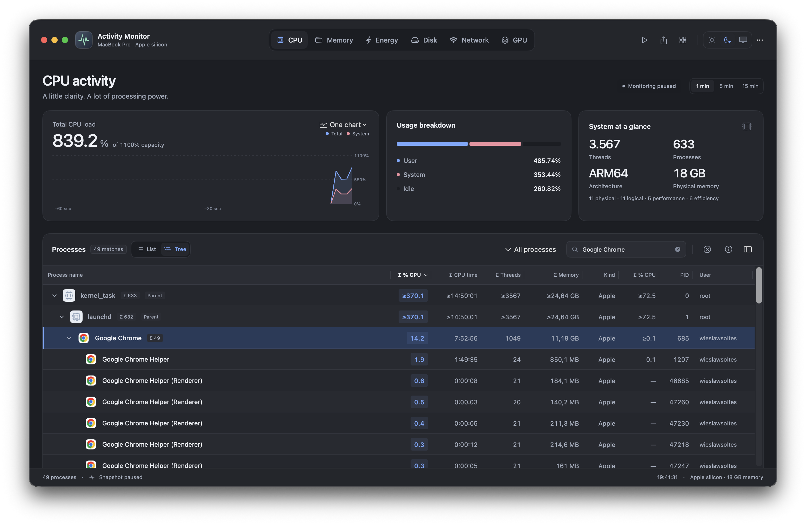
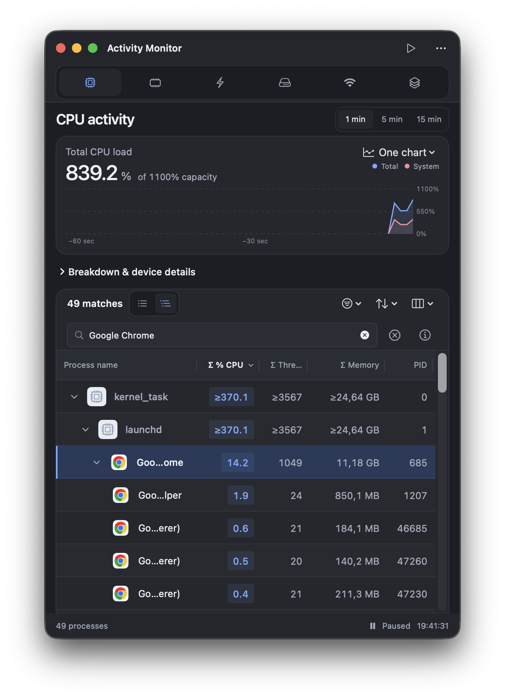
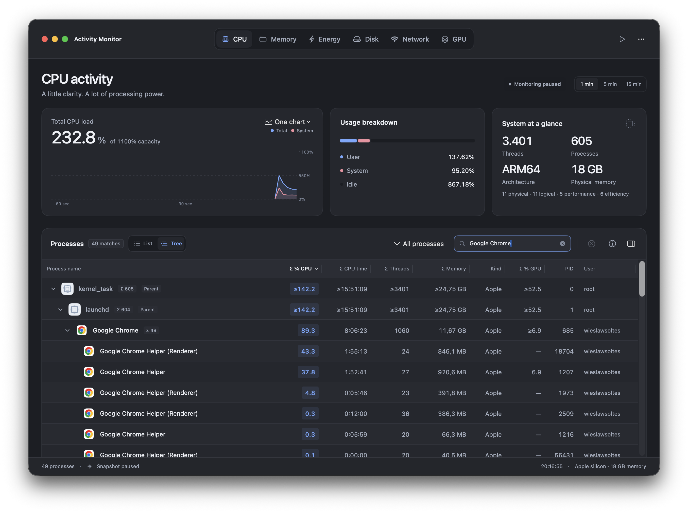

# List and Tree process views

Captured from the running PR 20 app on September 11, 2026. The four List/Tree comparison images use a real macOS process snapshot, paused at 19:41:31 CEST with the same **Google Chrome** search.

List shows the matching processes in column order. Tree keeps children under their parents and includes the muted **kernel_task** and **launchd** ancestor rows. The count reports the 49 search matches; those two context rows are additional. Tree columns marked **Σ** include every current descendant, including hidden ones. Chrome shows 14.2% CPU and 11.18 GB across its 49-process subtree; List shows its own 4.2% CPU and 647.3 MB. The **≥** prefix marks partial totals. Memory is summed process accounting and can overlap across shared mappings; it is not unique physical RAM.

| List | Tree |
| --- | --- |
|  |  |

## Dark appearance and compact window

The wide window is 1,440 × 900 points. The compact window is 520 × 760 points and preserves the expanded branch and selected Chrome process. Long names truncate within the name column; hover reveals their complete name and parent.

| Wide | Compact |
| --- | --- |
|  |  |

See [Follow process families](../../process-tree.md) for sorting, searching, keyboard navigation and export behavior.

## Medium-width header alignment

At 1,244 × 900 points, the metric tabs share the vertical center of the header with the window controls, title and actions. Windows narrower than 1,120 points retain the stacked header. Captured in dark appearance at 20:16:55 CEST on September 11, 2026; native checks also covered light appearance, tab switching and resizing across the breakpoint.

